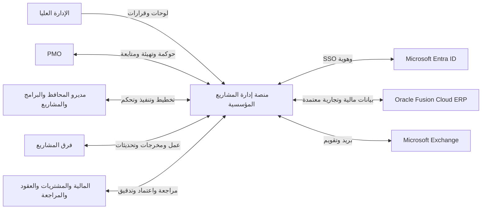
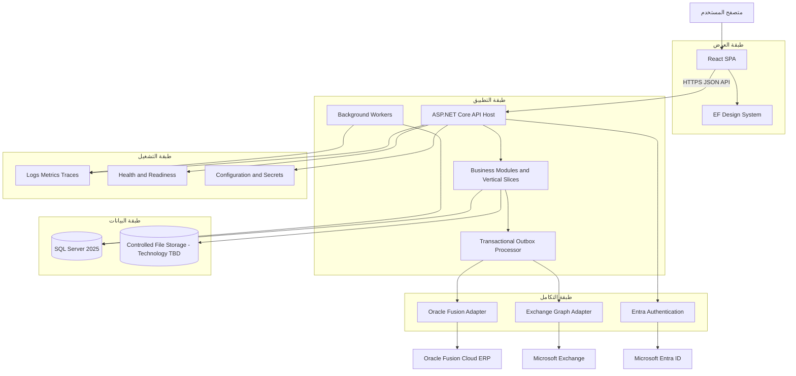
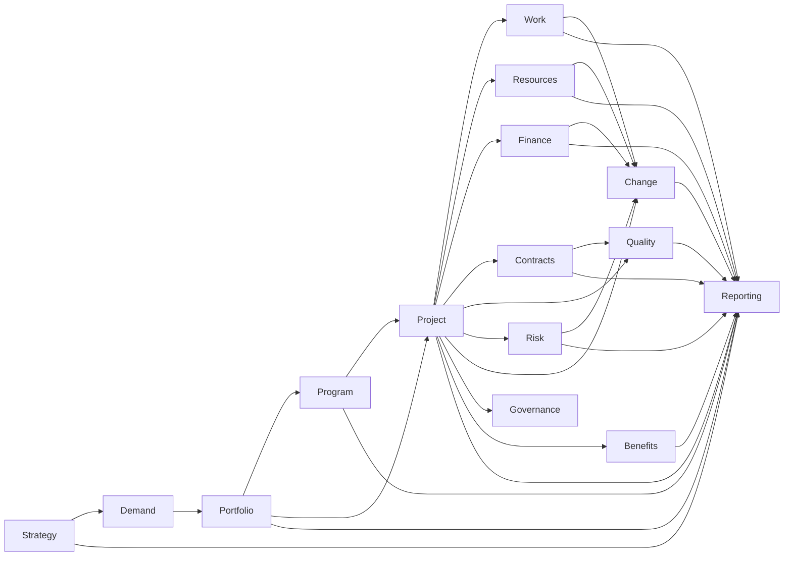
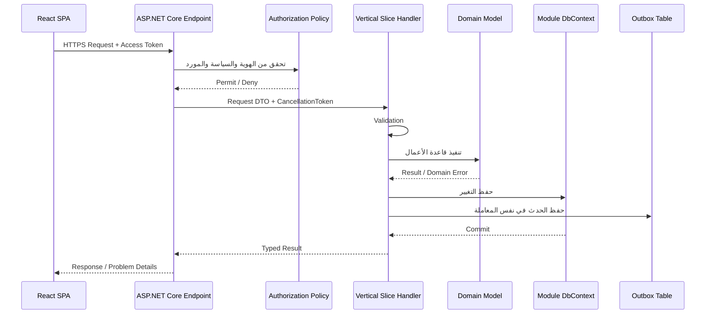
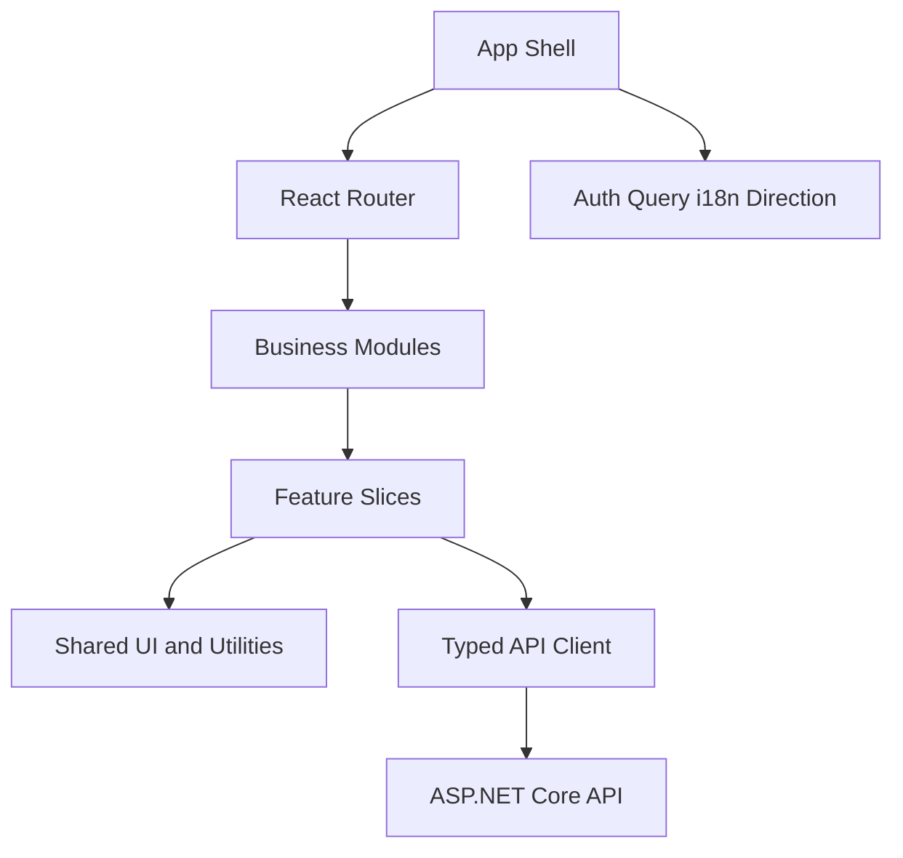
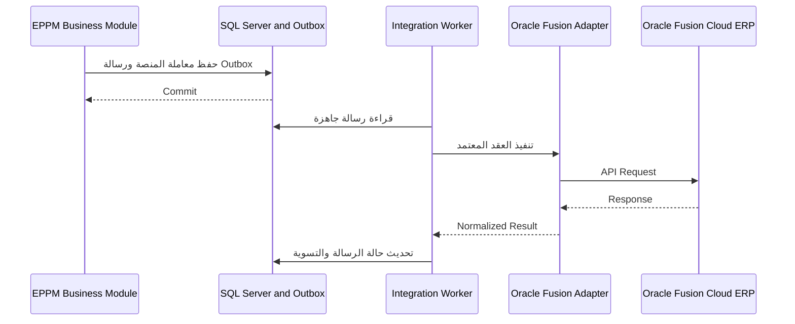
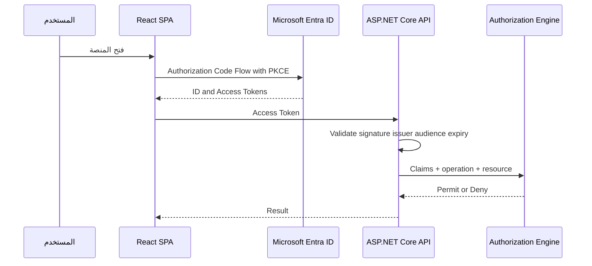
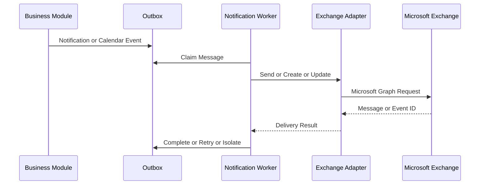
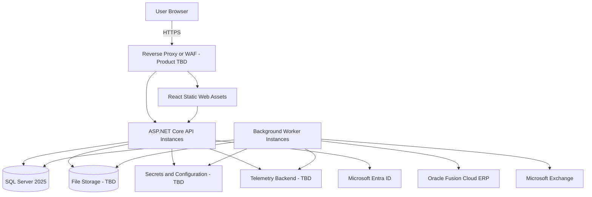

# نظرة عامة على الحل والمعمارية

## الغرض

توثق هذه الوثيقة المعمارية الشاملة المقترحة لمنصة إدارة المشاريع المؤسسية لصندوق البيئة، وتحدد حدود النظام، والمكونات الرئيسية، ووحدات الأعمال، وملكية البيانات، وأنماط التواصل، والتدفقات الحرجة، والتكاملات المعتمدة، والأمن، والنشر، والمراقبة، والاعتماديات والمخاطر المعمارية.

تترجم الوثيقة القرارات المثبتة في `00-Technology-Stack.md` إلى نموذج معماري قابل للتفصيل والتنفيذ والاختبار. ولا تستبدل تصميم التطبيق التفصيلي أو تصميم البيانات وواجهات التكامل أو تصميم الأمن والتشغيل أو تجربة المستخدم.

## معلومات الوثيقة

| الحقل | القيمة |
|---|---|
| المشروع | منصة إدارة المشاريع المؤسسية لصندوق البيئة |
| الاسم الإنجليزي | Environment Fund Enterprise Project Management Platform |
| نوع الوثيقة | Solution Overview and Architecture |
| مالك الوثيقة | TBD — يحدد من صندوق البيئة |
| أُعدت بواسطة | تحليل نظم ومعمارية حلول بمساعدة الذكاء الاصطناعي وتحت توجيه المستخدم |
| المراجعون | TBD — معمارية المؤسسة والأمن السيبراني والتطبيقات والبيانات والتكامل والتشغيل والجودة وPMO |
| الإصدار | 0.2 |
| الحالة | Draft |
| التصنيف | Internal |
| آخر تحديث | 2026-07-18 |

## السياق المطلوب

1. `docs/00-Project-Index.md`
2. `docs/01-Requirements/01-Project-Overview.md`
3. `docs/01-Requirements/02-Business-Requirements.md`
4. `docs/01-Requirements/03-System-Requirements.md`
5. `docs/01-Requirements/04-Delivery-Backlog.md`
6. `docs/01-Requirements/05-Traceability-Matrix.md`
7. `docs/02-Solution-Design/00-Technology-Stack.md`

## قواعد قراءة الوثيقة

- `Confirmed`: قرار مثبت بتوجيه المستخدم أو في وثيقة التقنية.
- `Proposed`: تصميم مقترح يحتاج مراجعة واعتمادًا معماريًا.
- `Open`: قرار لم يحسم ولا يجوز للفريق اختراعه أثناء التنفيذ.
- `Out of Scope`: عنصر غير داخل حدود الحل أو التكامل المباشر الحالي.
- المعرفات `ARCMP` مكونات معمارية منطقية، ولا تعني بالضرورة مشروعًا برمجيًا أو خدمة مستقلة.
- المعرفات `ADR` قرارات تؤثر في بنية الحل ويجب الحفاظ على تاريخها عند التعديل.
- المعرفات `AR` مخاطر أو أسئلة معمارية مفتوحة.

## 1. الملخص التنفيذي للحل

الحل تطبيق ويب مؤسسي مطور خصيصًا لإدارة دورة حياة الاستراتيجية والطلب والمحافظ والبرامج والمشاريع والعمل والموارد والميزانيات والعقود والمخاطر والجودة والتغيير والحوكمة والمنافع والتقارير والمعرفة.

يعتمد الحل:

- React SPA للواجهة المؤسسية؛
- ASP.NET Core API على .NET 10 LTS؛
- SQL Server 2025 لبيانات المنصة؛
- Modular Monolith على مستوى الحل؛
- Business Modules واضحة الملكية؛
- Vertical Slices داخل كل وحدة؛
- Feature-based architecture في React؛
- تكاملات مباشرة مع Oracle Fusion Cloud ERP وMicrosoft Entra ID وMicrosoft Exchange فقط؛
- Transactional Outbox للرسائل والأحداث التي يجب ألا تضيع؛
- OpenTelemetry وسجلات ومقاييس وتتبع موزع؛
- العربية RTL والإنجليزية LTR وإمكانية الوصول؛ و
- نشر تدريجي عبر إصدارات وSprints دون تقليص النطاق المستهدف الموثق.

النظام ليس Microservices في خط الأساس، ولا يعد Oracle Fusion أوExchange أوEntra مخازن بديلة لبيانات إدارة المشاريع التي تملكها المنصة.

## 2. المحركات المعمارية

### 2.1 محركات الأعمال

1. إنشاء مصدر مؤسسي موحد لحالة المحافظ والبرامج والمشاريع.
2. توحيد الحوكمة والاعتمادات والبوابات وقرارات اللجان.
3. ربط المشاريع بالأهداف والمنافع والقيمة المتحققة.
4. تحسين التخطيط والجدولة والموارد والتكاليف والمخاطر والتغيير.
5. منع ازدواجية البيانات المالية والتجارية المملوكة لـOracle Fusion.
6. توفير معلومات تنفيذية وتشغيلية قابلة للتفسير والتدقيق.
7. دعم دورة حياة كاملة، وليس مجرد إدارة مهام.
8. دعم العربية والإنجليزية مع تجربة وصول مؤسسية.

### 2.2 محركات الجودة

| المحرك | التوجه المعماري |
|---|---|
| القابلية للصيانة | وحدات أعمال واضحة وVertical Slices واختبارات حدود معمارية |
| الأمن | Entra ID وPolicy-based Authorization وأقل صلاحية وتدقيق شامل |
| الاعتمادية | Outbox وIdempotency وإعادة المحاولة والتسوية وعدم فقد الرسائل |
| الأداء | Pagination واستعلامات محسنة وCaching مشروط وقياس فعلي |
| التوسع | Scale-out للتطبيق والـWorkers عند دعم منصة الاستضافة لذلك |
| التوافر | Health Checks ونشر محكوم ونسخ واستعادة وفق أهداف تعتمد لاحقًا |
| قابلية التدقيق | سجل أحداث الأعمال والاعتمادات والتكاملات والتغييرات الحساسة |
| قابلية الاختبار | عقود واضحة وعزل الوحدات واختبارات Functional وContract وArchitecture |
| قابلية التشغيل | Logs وMetrics وTraces وCorrelation IDs ولوحات تشغيل وتنبيهات |
| قابلية الوصول | Semantic HTML وKeyboard وFocus وContrast وRTL/LTR |

### 2.3 القيود المثبتة

- المكدس التقني المعتمد موثق في `00-Technology-Stack.md`.
- التكامل المباشر محصور في ثلاثة أنظمة فقط.
- الاستضافة ومنصة النشر والـTelemetry backend ما زالت مفتوحة.
- لا تستخدم تقنيات Preview أوBeta في الإنتاج.
- لا يستخدم Generic Repository فوق EF Core.
- لا يعتمد MediatR إلزاميًا.
- لا يسمح للواجهة بالوصول المباشر إلى Oracle Fusion أوMicrosoft Graph.
- لا يسمح لوحدة أعمال بالوصول المباشر إلى جداول أو`DbContext` وحدة أخرى.

## 3. حدود النظام

### 3.1 ما تملكه المنصة

تملك المنصة بصورة أساسية:

- الاستراتيجيات والأهداف والمواءمة الداخلية للمشاريع؛
- الطلبات والأفكار والتقييمات ودراسات الجدوى والأولويات؛
- المحافظ والبرامج والعلاقات والتبعيات؛
- تعريف المشاريع ومواثيقها وتصنيفاتها وحوكمتها؛
- النطاق والمتطلبات والمخرجات وWBS؛
- الجداول والمعالم والتبعيات وخطوط الأساس؛
- العمل والمهام واللوحات وأساليب Agile والهجين؛
- تخطيط الموارد والتخصيصات والطاقة والوقت داخل سياق المشروع؛
- التوقعات والإشارات المالية الخاصة بإدارة المشروع دون استبدال ERP؛
- سجلات المخاطر والقضايا والافتراضات والقيود والتبعيات؛
- طلبات التغيير وتحليل الأثر والاعتماد؛
- الجودة والمراجعات والقبول والشهادات؛
- الاجتماعات والقرارات والإجراءات وأصحاب المصلحة؛
- المنافع والنتائج والقيمة والتقييم اللاحق؛
- إغلاق المشروع والانتقال إلى التشغيل والدروس المستفادة؛
- صلاحيات الأعمال والتفويضات والسجل التدقيقي الخاص بالمنصة؛
- التقارير ولوحات المعلومات المشتقة من بيانات المنصة والبيانات المتكاملة المسموح بها؛ و
- تهيئة النماذج والقيم المرجعية والمسارات ضمن الحدود المعتمدة.

### 3.2 ما يبقى خارج ملكية المنصة

| النظام أو الجهة | الملكية المرجعية | حدود المنصة |
|---|---|---|
| Oracle Fusion Cloud ERP | السجلات المالية والتجارية المعتمدة في نطاق ERP | تقرأ أو ترسل البيانات المتفق عليها ولا تنشئ نسخة رئيسية قابلة للتعديل دون عملية معتمدة |
| Microsoft Entra ID | هوية المستخدم المؤسسية والمصادقة وسياسات الدخول | تربط الهوية بحساب داخلي وتطبق صلاحيات الأعمال داخل المنصة |
| Microsoft Exchange | البريد والتقويم والرسائل والأحداث | تستخدمه للتسليم والتقويم ولا تعتبره قاعدة بيانات للمشروع |
| فرق الأعمال وPMO | السياسات والقرارات ومصفوفات الاعتماد والتصنيفات | تهيئ القواعد المعتمدة ولا تخترعها المنصة |
| الأمن والتشغيل | السياسات الأمنية والتشغيلية والمنصات المؤسسية | تنفذ المتطلبات بعد اعتمادها |

### 3.3 خارج نطاق التكامل المباشر

لا يوجد تكامل مباشر حاليًا مع OpenText ECM أوPower BI أوأنظمة الموارد البشرية أوالمراسلات أوالاستراتيجية أوالمخاطر أوITSM أوأي منصة أخرى.

أي احتياج لتبادل ملف يدوي أواستيراد أوتصدير لا يحول النظام الخارجي إلى تكامل مباشر، ويجب توثيقه كعملية مستقلة بضوابط أمن وجودة بيانات.

## 4. سياق النظام

### 4.1 الجهات والأنظمة المحيطة

| الجهة أو النظام | العلاقة | البيانات أو التفاعل | الملكية | الأهمية |
|---|---|---|---|---|
| الإدارة العليا | مستهلك قرار | لوحات المحافظ والأداء والمخاطر والمنافع | صندوق البيئة | حرجة |
| PMO | حوكمة وتشغيل | الطلبات والمحافظ والبرامج والمشاريع والبوابات والتقارير | صندوق البيئة | حرجة |
| مدير المحفظة أوالبرنامج | إدارة | الأولويات والتبعيات والمنافع والتوقعات | صندوق البيئة | عالية |
| مدير المشروع | تشغيل ومساءلة | الخطة والعمل والتكلفة والمخاطر والتقارير والتغيير | صندوق البيئة | حرجة |
| فريق المشروع | تنفيذ | المهام والمخرجات والتحديثات والوقت والإجراءات | صندوق البيئة | عالية |
| المالية والمشتريات والعقود | تحقق وتعاون | الميزانيات والالتزامات والعقود والاستلامات والمدفوعات | صندوق البيئة وOracle | حرجة |
| المورد أوالاستشاري | مشاركة مقيدة عند اعتمادها | مخرجات وإجراءات ووثائق محددة | TBD | متوسطة إلى عالية |
| مسؤول النظام | إدارة تقنية | التهيئة والمراجع والصلاحيات والمراقبة | تقنية المعلومات | حرجة |
| المراجع | قراءة وتدقيق | السجلات والقرارات والتغييرات والأدلة | صندوق البيئة | عالية |
| Oracle Fusion Cloud ERP | نظام خارجي معتمد | بيانات مالية وتجارية وتحديثات متفق عليها | صندوق البيئة | حرجة |
| Microsoft Entra ID | موفر هوية | المصادقة وSSO والClaims المعتمدة | صندوق البيئة | حرجة |
| Microsoft Exchange | بريد وتقويم | رسائل وتنبيهات ودعوات وأحداث | صندوق البيئة | عالية |

### 4.2 مخطط السياق



## 5. النظرة المعمارية المنطقية

### 5.1 طبقات المسؤولية



### 5.2 نمط التطبيق

يتكون النظام من تطبيق React واحد وAPI Host واحد وعمليات خلفية منطقية قابلة للتشغيل داخل نفس وحدة النشر أوفي Worker مستقل حسب قرار النشر والأحمال.

تبقى الوحدات داخل Modular Monolith، لكن تفرض حدودها في الكود والبيانات والعقود والاختبارات. لا يعني وجود API Host واحد أن الوحدات تملك بعضها أوتتجاوز حدودها.

### 5.3 وحدات النشر المنطقية

| الوحدة المنطقية | الحالة | المسؤولية |
|---|---|---|
| React Web Application | Confirmed | تجربة المستخدم والتوجيه والنماذج وعرض البيانات |
| ASP.NET Core API | Confirmed | نقاط الدخول والتحقق والتفويض وتنفيذ حالات الاستخدام |
| Background Worker | Proposed | Outbox والمهام المجدولة والتسوية والتنبيهات المؤجلة |
| SQL Server Database | Confirmed | بيانات المنصة وسجل التدقيق وOutbox |
| Controlled File Storage | Open | حفظ المرفقات والنسخ الخاضعة للرقابة إذا اعتمدت الحاجة |
| Telemetry Backend | Open | استقبال السجلات والمقاييس والتتبع والتنبيهات |
| Secrets and Configuration Store | Open | حفظ الأسرار والتهيئة الحساسة خارج الكود |

## 6. سجل المكونات المعمارية

| المعرف | المكون | الحالة | المسؤولية الأساسية | المدخلات | المخرجات |
|---|---|---|---|---|---|
| ARCMP-001 | React Application Shell | Confirmed | التهيئة العامة والProviders والتوجيه والتخطيطات | إعدادات عامة وجلسة المستخدم | واجهة التطبيق ومسارات الوحدات |
| ARCMP-002 | EF Design System | Confirmed | مكونات Tailwind وTokens وRTL/LTR والوصول | الهوية البصرية ومتطلبات الوصول | مكونات واجهة متسقة |
| ARCMP-003 | Frontend Business Modules | Confirmed | صفحات وFeatures حسب مجالات الأعمال | API contracts وUser actions | Views وCommands وQueries |
| ARCMP-004 | Frontend API Client | Confirmed | عميل Typed مولد من OpenAPI واستخدام Fetch | OpenAPI document وAccess token | HTTP requests وTyped responses |
| ARCMP-005 | API Host | Confirmed | Middleware وRoute Groups وOpenAPI وHealth | HTTP requests | Typed HTTP responses |
| ARCMP-006 | Authentication Boundary | Confirmed | التحقق من Tokens والتكامل مع Entra | OIDC/JWT tokens | هوية موثقة وClaims |
| ARCMP-007 | Authorization Engine | Confirmed | Policies وصلاحيات الأعمال ونطاق البيانات | User identity وResource context | Permit أوDeny مع Audit |
| ARCMP-008 | Strategy Module | Proposed | الأهداف والمواءمة والنتائج الاستراتيجية | بيانات الاستراتيجية الداخلية | روابط المواءمة ومؤشرات النتائج |
| ARCMP-009 | Demand Management Module | Proposed | استقبال الطلبات والتقييم الأولي ودراسات الجدوى | طلبات وأفكار ومرفقات | قرارات تقييم وترشيح |
| ARCMP-010 | Portfolio Management Module | Proposed | المحافظ والأولويات والسيناريوهات والتوازن | مشاريع وبرامج وقيود | قرارات المحفظة وتوقعاتها |
| ARCMP-011 | Program Management Module | Proposed | البرامج والتبعيات والمخرجات والمنافع المشتركة | مشاريع ومنافع وتبعيات | حالة البرنامج وقراراته |
| ARCMP-012 | Project Management Module | Proposed | تعريف المشروع والميثاق والنطاق والحوكمة الأساسية | قرار التأسيس وبيانات المشروع | سجل مشروع معتمد |
| ARCMP-013 | Work and Schedule Module | Proposed | WBS والجداول والمعالم والمهام وAgile | خطة ونطاق وموارد | Baselines وحالة التنفيذ |
| ARCMP-014 | Resource Management Module | Proposed | الموارد والمهارات والطاقة والتخصيص والوقت | مستخدمون ومشاريع واحتياج | تخصيصات وتعارضات وتوقعات |
| ARCMP-015 | Financial Management Module | Proposed | ميزانيات المشروع والتوقعات والتحليل وربط ERP | بيانات المشروع وبيانات Oracle | رؤية مالية للمشروع |
| ARCMP-016 | Procurement and Contracts Module | Proposed | المرجع التشغيلي للعقود والموردين والمخرجات التجارية | بيانات Oracle وسجلات المشروع | حالة تجارية مرتبطة بالمشروع |
| ARCMP-017 | Deliverables and Quality Module | Proposed | المخرجات والمراجعة والقبول والجودة وعدم المطابقة | مخرجات وخطط جودة | قبول أوإعادة أوإجراء تصحيحي |
| ARCMP-018 | Risk and Issues Module | Proposed | المخاطر والقضايا والافتراضات والقيود والتبعيات | تحديثات المشروع | تقييمات وإجراءات وتصعيدات |
| ARCMP-019 | Change Control Module | Proposed | طلبات التغيير وتحليل الأثر والاعتماد وخطوط الأساس | تغيير مقترح وآثاره | قرار وتحديث Baseline |
| ARCMP-020 | Governance and Meetings Module | Proposed | البوابات واللجان والاجتماعات والقرارات والإجراءات | أجندة وقرارات ومشاركون | محاضر وقرارات وإجراءات |
| ARCMP-021 | Benefits Management Module | Proposed | المنافع والنتائج والقيمة والتقييم اللاحق | أهداف ومقاييس وقيم فعلية | حالة تحقيق المنافع |
| ARCMP-022 | Reporting Module | Proposed | Read Models ولوحات وتقارير وتصدير مضبوط | بيانات وحدات وبيانات متكاملة | تقارير تنفيذية وتشغيلية |
| ARCMP-023 | Administration Module | Proposed | القيم المرجعية والقوالب والمسارات والتهيئة | قرارات إدارية معتمدة | Configuration versions |
| ARCMP-024 | Audit Service | Proposed | أحداث التدقيق والتغييرات الحساسة والأدلة | أحداث المستخدم والنظام | سجل تدقيق غير قابل للتعديل العادي |
| ARCMP-025 | Outbox Store and Processor | Confirmed | ضمان نشر الرسائل بعد نجاح المعاملة | Outbox messages | رسائل معالجة أوحالة فشل |
| ARCMP-026 | Background Job Coordinator | Proposed | المهام المجدولة والتسوية والتنبيهات | جداول وتشغيل وOutbox | نتائج وظائف وأحداث تشغيل |
| ARCMP-027 | Oracle Fusion Adapter | Confirmed Boundary | Anti-corruption layer وMapping وResilience | عقود المنصة وOracle | بيانات متكاملة وتسوية |
| ARCMP-028 | Exchange Adapter | Confirmed Boundary | بريد وتقويم عبر Microsoft Graph | رسائل وأحداث معتمدة | Message/Event IDs وحالة التسليم |
| ARCMP-029 | SQL Server Data Platform | Confirmed | Schemas ووحدات البيانات والمعاملات والفهارس | Commands وQueries | بيانات مستدامة |
| ARCMP-030 | Controlled File Service | Open | تحميل وفحص وحفظ واسترجاع المرفقات | ملفات وMetadata | File reference ومحتوى مضبوط |
| ARCMP-031 | Observability Services | Confirmed Logical | Logs وMetrics وTraces وCorrelation | Telemetry signals | لوحات وتنبيهات وتحليل |
| ARCMP-032 | Health and Readiness Service | Confirmed | فحص التطبيق وقاعدة البيانات والتكاملات الحرجة | Probes | Health status |
| ARCMP-033 | Configuration and Secrets Boundary | Confirmed Logical | توفير التهيئة والأسرار حسب البيئة | Environment configuration | Runtime settings دون كشف أسرار |

## 7. حدود وحدات الأعمال

### 7.1 قواعد الملكية

- تملك كل وحدة Entities وAggregates وTables وQueries وCommands الخاصة بها.
- تستخدم الوحدة Schema مستقلًا في SQL Server عند اعتماد النموذج النهائي.
- لا تنشئ الوحدة Foreign Key مباشرًا إلى جدول وحدة أخرى دون ADR استثنائي.
- تستخدم معرفات مرجعية وعقود قراءة أوأحداثًا داخلية للتعاون بين الوحدات.
- لا تنشر Domain Entities بين الوحدات؛ تنشر Contracts محددة.
- لا تستخدم وحدة Reporting للوصول غير المنضبط إلى جداول التشغيل؛ تستخدم Read Models أوViews أونسخ قراءة معتمدة.

### 7.2 خريطة الوحدات المقترحة

| الوحدة | ما تملكه | ما تقرؤه من غيرها | الأحداث الرئيسية |
|---|---|---|---|
| Strategy | الأهداف والنتائج والمواءمة | المحافظ والمشاريع والمنافع | ObjectiveChanged، AlignmentUpdated |
| Demand Management | الطلبات والتقييم والجدوى | الاستراتيجية والقدرة المالية المرجعية | DemandSubmitted، DemandApproved |
| Portfolio Management | المحافظ والسيناريوهات والأولوية | الطلبات والبرامج والمشاريع والمنافع | PortfolioDecisionRecorded |
| Program Management | البرامج والتبعيات المشتركة | المشاريع والمنافع والمخاطر | ProgramCreated، DependencyChanged |
| Project Management | سجل المشروع والميثاق والتصنيف والحوكمة | الطلب والمحفظة والبرنامج | ProjectCreated، ProjectStatusChanged |
| Work and Schedule | WBS والجداول والمهام والمعالم وخطوط الأساس | المشروع والموارد | BaselineApproved، MilestoneChanged |
| Resource Management | التخصيصات والطاقة والمهارات والوقت | المستخدمون والمشاريع والجداول | AllocationChanged، CapacityConflictDetected |
| Financial Management | ميزانية المشروع والتوقعات والتحليل | المشروع وOracle | ForecastUpdated، CostVarianceDetected |
| Procurement and Contracts | الروابط التجارية والموردون والعقود والمخرجات التجارية | المشروع وOracle | ContractLinked، CommercialStatusChanged |
| Deliverables and Quality | المخرجات والمراجعات والقبول والجودة | المشروع والعقد | DeliverableSubmitted، DeliverableAccepted |
| Risk and Issues | المخاطر والقضايا والقيود والتبعيات | المشروع والبرنامج | RiskEscalated، IssueResolved |
| Change Control | طلب التغيير وتحليل الأثر والقرار | النطاق والجدول والمال والمخاطر | ChangeApproved، BaselineChangeRequested |
| Governance and Meetings | البوابات والاجتماعات والقرارات والإجراءات | جميع الوحدات عبر مراجع | GateDecisionRecorded، ActionAssigned |
| Benefits Management | المنافع والمقاييس والقيم | الاستراتيجية والبرنامج والمشروع | BenefitMeasurementRecorded |
| Reporting | Read Models والتقارير والتصدير | بيانات مصرح بها من الوحدات | ReportGenerated |
| Administration | القيم المرجعية والقوالب والتهيئة | لا يعتمد على منطق الأعمال | ConfigurationPublished |

### 7.3 علاقات الاعتماد المقترحة



يوضح المخطط اعتمادًا مفاهيميًا للقراءة أوالأحداث، ولا يسمح بمراجع مشاريع برمجية أووصول بيانات مباشر تلقائيًا.

## 8. معمارية طلبات Backend

### 8.1 مسار الطلب المتزامن



### 8.2 قواعد التنفيذ

- يملك كل Endpoint حالة استخدام واحدة واضحة.
- تتم المصادقة قبل الدخول إلى Slice.
- يطبق التفويض على مستوى العملية والمورد ونطاق البيانات.
- يتم التحقق البنيوي قبل تنفيذ قواعد Domain.
- لا تعاد Entities مباشرة إلى الواجهة.
- تستخدم Problem Details مع Code ثابت وTrace ID.
- تحفظ أحداث Outbox في المعاملة نفسها عند وجود أثر خارجي أوحدث داخلي موثوق.
- يمنع إجراء استدعاء خارجي طويل داخل معاملة SQL.
- تطبق Optimistic Concurrency على السجلات المتزامنة.

## 9. معمارية React

### 9.1 هيكل المسؤولية



### 9.2 قواعد الواجهة

- كل Module في الواجهة يعكس مجال أعمال واضحًا.
- كل Feature تملك صفحاتها ونماذجها وSchemas واستعلاماتها واختباراتها.
- Server State يدار بواسطة TanStack Query.
- URL State يستخدم للفلاتر والفرز والصفحات القابلة للمشاركة.
- Form State يدار بواسطة React Hook Form وZod عند الحاجة.
- Zustand يستخدم فقط لحالة UI مشتركة مثبتة، ولا يخزن نسخة من بيانات API.
- لا يستخدم `useEffect` لاشتقاق بيانات أثناء العرض.
- لا تستدعي المكونات العامة API مباشرة.
- يطبق Route-level Code Splitting وError Boundaries.
- يولد عميل TypeScript من OpenAPI في CI أوخطوة بناء محكومة.
- لا تحفظ Access Tokens في Local Storage.
- لا تعد حماية Route في الواجهة بديلًا عن تفويض API.

### 9.3 Design System

يبنى Design System خاص بصندوق البيئة باستخدام Tailwind CSS، ويغطي:

- Design Tokens؛
- الألوان والخطوط والمسافات والحواف والظلال والحركة؛
- الحالات الدلالية؛
- Components قابلة للوصول؛
- العربية والإنجليزية؛
- RTL وLTR باستخدام Logical Properties؛
- Keyboard وFocus وScreen Reader؛
- الجداول والنماذج والحوارات والتنبيهات واللوحات التنفيذية؛ و
- Visual Regression عند اعتماد أداة CI المناسبة.

## 10. معمارية البيانات

### 10.1 نموذج الملكية

تعتمد المنصة قاعدة SQL Server واحدة في خط الأساس مع Schema منطقي مستقل لكل وحدة. لا يعني ذلك قاعدة مشتركة بلا حدود؛ بل تبقى ملكية الجداول والقراءة والكتابة محكومة حسب الوحدة.

أمثلة أولية:

```text
strategy.*
demand.*
portfolio.*
programs.*
projects.*
work.*
resources.*
finance.*
contracts.*
quality.*
risk.*
change.*
governance.*
benefits.*
reporting.*
administration.*
audit.*
integration.*
```

### 10.2 مبادئ البيانات

- SQL Server هو مخزن بيانات المنصة، وليس نسخة بديلة غير مضبوطة من Oracle.
- يستخدم `DbContext` مستقل لكل وحدة عندما يعزز الملكية والاختبار.
- تحفظ التواريخ النظامية بصيغة UTC.
- تستخدم RowVersion أوآلية Concurrency مناسبة للسجلات الحساسة.
- تستخدم Pagination واستعلامات مسقطة إلى DTOs.
- تنشأ Indexes من واقع الاستعلامات وخطط التنفيذ.
- تراجع EF Core Migrations وSQL الناتج قبل الإنتاج.
- لا تنفذ Migrations تلقائيًا عند بدء التطبيق في الإنتاج.
- يحدد الاحتفاظ والأرشفة والحذف وLegal Hold لاحقًا مع ملاك البيانات.
- تستخدم بيانات اصطناعية أومقنعة خارج الإنتاج.

### 10.3 Read Models والتقارير

يستخدم Reporting Module نماذج قراءة مصممة للعرض والتحليل. الخيارات التفصيلية ما تزال مفتوحة، ويمكن أن تشمل:

- SQL Views مصرح بها؛
- جداول Read Model تحدث بالأحداث؛
- Queries مركبة داخل حدود أداء معتمدة؛ أو
- Cache قراءة محدود مع سياسة تحديث واضحة.

لا يجوز لوحدة التقارير تعديل البيانات التشغيلية أوتجاوز سياسات نطاق البيانات.

### 10.4 المرفقات

المرفقات قدرة منطقية مطلوبة، لكن تقنية التخزين لم تعتمد. يجب أن يوفر التصميم النهائي:

- فحص نوع الملف والحجم والمحتوى الضار؛
- تشفير النقل والتخزين؛
- Metadata وتصنيفًا ومالكًا وسجلًا تدقيقيًا؛
- روابط غير قابلة للتخمين ووصولًا مصرحًا؛
- سياسات احتفاظ وحذف وLegal Hold؛
- منع تخزين الملفات الحساسة في سجلات التطبيق؛ و
- فصل الملفات عن قاعدة SQL عند الحاجة التشغيلية المعتمدة.

## 11. معمارية التكامل

### 11.1 المبادئ المشتركة

- جميع التكاملات تمر من الخادم عبر Adapters مستقلة.
- تستخدم Anti-corruption Layer لحماية نموذج المنصة من نماذج الأنظمة الخارجية.
- توثق Data Contracts والإصدارات والاتجاه والتواتر ومصدر الحقيقة.
- تستخدم Correlation ID عبر الطلب والOutbox والتكامل.
- تطبق Timeouts وRetry للأخطاء المؤقتة وCircuit Breaker عند الحاجة.
- تطبق Idempotency على العمليات القابلة للتكرار.
- تسجل حالات النجاح والفشل وإعادة المحاولة والتسوية.
- لا تحفظ Credentials في الكود أوFrontend.
- لا تنفذ إعادة المحاولة غير المحدودة.
- توضع الرسائل غير القابلة للمعالجة في حالة عزل قابلة للمراجعة وإعادة التشغيل.

### 11.2 Oracle Fusion Cloud ERP

يعد Oracle مصدر الحقيقة للبيانات المالية والتجارية التي يملكها. يستخدم Adapter مستقل لتطبيق المصادقة والMapping والتسوية ومعالجة الأخطاء.



يجب أن يحدد التصميم التفصيلي:

- Business Objects المطلوبة؛
- القراءة أوالكتابة لكل Object؛
- التواتر والحداثة؛
- الحقول والتحويلات؛
- أرقام المراجع المتبادلة؛
- قواعد التصحيح؛
- التسوية وكشف الفروقات؛
- حدود المعدل والتوافر؛ و
- المسؤولية التشغيلية عند الفشل.

### 11.3 Microsoft Entra ID

يستخدم Entra للمصادقة وSSO، بينما تبقى صلاحيات الأعمال التفصيلية ونطاق البيانات داخل المنصة ما لم يعتمد Mapping رسمي.



يجب اعتماد:

- Tenant وApp Registrations؛
- Redirect URIs؛
- Scopes وApp Roles؛
- Claims mapping؛
- MFA وConditional Access؛
- Session behavior؛
- المستخدمين الخارجيين؛
- تعطيل الحساب والوصول؛ و
- ربط المستخدم الداخلي بالهوية المؤسسية.

### 11.4 Microsoft Exchange

يتم التكامل من الخادم عبر Microsoft Graph لإرسال البريد وإدارة أحداث التقويم المعتمدة.



لا تحفظ بيانات المشروع الرسمية في Exchange. يحتفظ النظام فقط بالمراجع اللازمة للتتبع مثل Message ID أوEvent ID وحالة الإرسال عندما يكون ذلك مطلوبًا.

## 12. التدفقات الحرجة

### 12.1 إنشاء مشروع

1. يبدأ المستخدم Feature إنشاء المشروع.
2. تتحقق الواجهة من الحقول الأساسية لتحسين التجربة.
3. يتحقق API من الهوية والصلاحية ونطاق البيانات.
4. يتحقق Handler من الطلب وقواعد التكرار والتصنيف.
5. ينشئ Project Aggregate معرفًا ثابتًا وحالة أولية.
6. يحفظ Project Module السجل وأحداث التدقيق في معاملة واحدة.
7. تحفظ أحداث داخلية أوOutbox حسب الحاجة.
8. تعاد استجابة Typed مع رقم المشروع وإصدار Concurrency.

### 12.2 اعتماد بوابة أوتغيير

1. يقدم المستخدم السجل للاعتماد.
2. يثبت النظام النسخة المقدمة ولا يسمح بتغيير غير مضبوط.
3. ينشئ Governance Module خطوة الاعتماد وفق المسار المعتمد.
4. يرسل Exchange Worker الإشعار أوالدعوة عند الحاجة.
5. يتحقق كل معتمد من صلاحية الدور والتفويض وعدم انتهاء الخطوة.
6. يسجل القرار والسبب والتاريخ والهوية.
7. عند اكتمال المسار ينشر حدث القرار إلى الوحدة المالكة.
8. تحدث الحالة أوBaseline مع حفظ التاريخ السابق.

### 12.3 مزامنة بيانات Oracle

1. تحدد وظيفة التكامل السجلات أوالفترة المطلوبة.
2. يستدعي Oracle Adapter العقد المعتمد.
3. يحول الرد إلى نموذج تكامل داخلي.
4. يتحقق من الجودة والمفاتيح والمراجع.
5. يحدث Module المالك نسخة القراءة أومرجع التكامل.
6. يسجل وقت المصدر والتحميل والCorrelation ID.
7. تنفذ التسوية وتظهر الفروقات للحل التشغيلي.

### 12.4 تقرير حالة المشروع

1. يجمع Reporting Module البيانات المصرح بها من Read Models.
2. يطبق نطاق المستخدم والفلاتر والسياسات.
3. يعرض المصدر ووقت التحديث وحالة حداثة التكاملات.
4. يمنع تعديل البيانات من التقرير.
5. يسجل التصدير عند اشتماله على بيانات حساسة أومقيدة.

### 12.5 إغلاق المشروع

1. يتحقق النظام من المخرجات والقبول والمخاطر والإجراءات والعقود والبيانات المالية المطلوبة.
2. يعرض الاستثناءات المفتوحة ولا يغلق المشروع بصمت.
3. يسجل قرار الإغلاق ومسؤوليات الانتقال.
4. ينشئ سجل الدروس والمنافع اللاحقة.
5. يقفل التعديلات التشغيلية وفق القاعدة المعتمدة.
6. يحتفظ بالسجلات والمرفقات وفق سياسة الاحتفاظ.

## 13. معمارية الأمن

### 13.1 مناطق الثقة

| المنطقة | الثقة | الضوابط الأساسية |
|---|---|---|
| متصفح المستخدم | غير موثوق | PKCE وCSP وعدم وجود Secrets والتحقق الخادمي |
| حدود Web/API | منطقة دخول | TLS وHeaders وRate Controls وValidation وProblem Details |
| طبقة التطبيق | موثوقة بصورة مقيدة | Policies وLeast Privilege وAudit وحدود الوحدات |
| قاعدة البيانات | بيانات حساسة | حسابات خدمة محدودة وتشفير واتصالات آمنة ونسخ محكومة |
| Workers | عمليات خلفية مقيدة | هوية خدمة وأقل صلاحية وIdempotency ومراقبة |
| الأنظمة الخارجية | ثقة تعاقدية محدودة | Tokens أوCredentials محمية وعقود وTimeout وReconciliation |

### 13.2 المصادقة والتفويض

- Entra ID هو موفر المصادقة الوحيد ضمن النطاق الحالي.
- يتحقق API من Issuer وAudience وSignature وExpiry.
- تستخدم Policies بدل شروط أدوار متناثرة.
- يطبق التفويض على مستوى العملية والمورد والجهة والبيانات.
- تدعم المنصة التفويض المؤقت وفق قواعد أعمال معتمدة.
- تمنع صلاحيات الواجهة من أن تكون مصدر القرار الأمني.
- تسجل القرارات الحساسة وتغيير الصلاحيات والتفويضات.

### 13.3 حماية البيانات

- تصنف البيانات قبل تحديد التشفير والاحتفاظ والمشاركة.
- تستخدم TLS لجميع الاتصالات.
- تستخدم حماية مناسبة للبيانات الحساسة في التخزين بعد اعتماد منصة الاستضافة.
- تمنع البيانات الحساسة وTokens وCredentials من Logs.
- تحدد سياسات Masking وExport وDownload حسب الدور.
- تفصل بيانات البيئات، ولا تنسخ بيانات الإنتاج الخام إلى الاختبار.

### 13.4 حماية التطبيق

- Input Validation وOutput Encoding.
- حماية من XSS وCSRF وفق نموذج المصادقة النهائي.
- CSP وSecurity Headers.
- رفع ملفات مضبوط وفحص محتوى.
- Dependency وSecret وSAST وLicense Scanning.
- Rate Limiting للعمليات الحساسة أوالمكلفة عند اعتماد الحدود.
- اختبار اختراق ومراجعة أمنية قبل الإنتاج.

## 14. النشر والبيئات

### 14.1 البيئات المطلوبة

| البيئة | الغرض | البيانات | الوصول |
|---|---|---|---|
| Local Development | تطوير وتشغيل محلي | بيانات اصطناعية | المطورون |
| Development | دمج مبكر واختبارات آلية | بيانات اصطناعية | الفريق التقني |
| SIT / Integration | اختبار التكامل والعقود | بيانات اختبار منضبطة | التقنية والتكامل |
| UAT | قبول الأعمال | بيانات مقنعة أوحالات معتمدة | مستخدمو UAT |
| Pre-Production | تحقق نشر وتشغيل عند اعتماد الحاجة | مماثلة بنيويًا للإنتاج | فرق محدودة |
| Production | الاستخدام الفعلي | بيانات فعلية | مستخدمون مصرحون |
| Disaster Recovery | الاستمرارية عند اعتمادها | نسخة محكومة | التشغيل والطوارئ |

### 14.2 مخطط نشر منطقي



هذا المخطط منطقي ولا يثبت Azure أوOn-premises أوContainers أوVirtual Machines أوKubernetes أوخدمة استضافة محددة.

### 14.3 مبادئ النشر

- يبنى Frontend وBackend كArtifacts قابلة لإعادة النشر.
- تستخدم تهيئة خارج Artifact حسب البيئة.
- لا تحفظ Secrets في المستودع أوملفات البناء.
- تستخدم موافقات وEvidence للنشر إلى UAT والإنتاج.
- تنفذ Migrations في خطوة منفصلة محكومة.
- توجد خطة Rollback للتطبيق والبيانات والتهيئة.
- يحدد Zero-downtime أوMaintenance Window بعد اعتماد الاستضافة وNFRs.

## 15. الاعتمادية والاستمرارية

### 15.1 ضوابط الاعتمادية

- Transactional Outbox للأحداث والتكاملات الموثوقة.
- Idempotency Keys للطلبات الخارجية القابلة للتكرار.
- Retry محدود للأخطاء المؤقتة مع Backoff وJitter.
- Circuit Breaker عندما يحمي النظام من فشل متكرر.
- Timeout صريح لكل استدعاء خارجي.
- عزل الرسائل الفاشلة مع سبب وقابلية إعادة التشغيل.
- Optimistic Concurrency للتعديلات المتزامنة.
- Health وReadiness Checks قبل استقبال المرور.
- Graceful shutdown للـWorkers والطلبات الجارية.
- Reconciliation للتكاملات التي تحتاج إثبات التطابق.

### 15.2 النسخ والاستعادة

لم تعتمد أهداف RPO وRTO أوتقنية النسخ وHA وDR. يجب أن يحدد التصميم التشغيلي:

- تصنيف الخدمات والبيانات الحرجة؛
- RPO وRTO؛
- النسخ الكامل والتفاضلي وسجل المعاملات؛
- تشفير النسخ وحمايتها؛
- موقع النسخ ومدة الاحتفاظ؛
- اختبارات الاستعادة الدورية؛
- Failover وFailback؛ و
- خطط العمل اليدوي أثناء الانقطاع.

## 16. المراقبة والتشغيل

### 16.1 الإشارات المطلوبة

- Structured application logs؛
- Security and audit events؛
- HTTP request metrics؛
- Database latency and failures؛
- Queue وOutbox depth؛
- Background job duration and failure؛
- Oracle integration success and freshness؛
- Exchange delivery and calendar failures؛
- Authentication and authorization failures؛
- Frontend error telemetry بعد اعتماد أداة آمنة؛
- Health and readiness status؛ و
- Business-critical flow metrics.

### 16.2 Correlation

يولد Correlation ID عند حدود الطلب إذا لم يرد معرف صالح، ويستمر عبر:

```text
Browser
→ API
→ Vertical Slice
→ Database and Audit
→ Outbox
→ Worker
→ Oracle or Exchange
```

يجب ألا يتضمن Correlation ID بيانات شخصية أوأسرارًا.

### 16.3 أهداف التشغيل المفتوحة

تبقى ساعات الخدمة وSLA وAlert thresholds وRetention وOn-call وEscalation وSupport tiers وTelemetry backend مفتوحة وتحتاج اعتمادًا.

## 17. الأداء وقابلية التوسع

### 17.1 مبادئ الأداء

- Server-side pagination والفرز والتصفية.
- Projection إلى DTO بدل تحميل Graph كامل.
- منع N+1 Queries.
- استخدام AsNoTracking للقراءات المناسبة.
- فهرسة مبنية على القياس.
- Lazy Loading غير معتمد افتراضيًا في EF Core.
- Route-level code splitting في React.
- تقليل Bundle والاعتماديات ومراقبة أحجام البناء.
- Cache فقط عند وجود نمط قراءة وهدف صلاحية واضح.
- عدم Cache بيانات حساسة أوصلاحيات دون تصميم أمني.

### 17.2 نموذج التوسع

التطبيق مصمم مبدئيًا ليكون Stateless قدر الإمكان حتى يمكن تشغيل أكثر من Instance عند الحاجة. يجب أن تكون الجلسة والمفاتيح والJobs والOutbox قابلة للعمل في بيئة متعددة النسخ.

لا يعتمد Scale-out أوDistributed Cache أوQueue خارجية حتى تثبت الحاجة ويعتمد قرار الاستضافة.

### 17.3 قياسات مطلوبة قبل الجاهزية

- عدد المستخدمين المتزامنين؛
- أحجام المحافظ والبرامج والمشاريع والمهام؛
- أحجام المرفقات؛
- معدل العمليات والاعتمادات؛
- حجم التقارير والتصدير؛
- تواتر Oracle وExchange؛
- أزمنة الاستجابة المستهدفة؛ و
- نوافذ الوظائف الخلفية.

## 18. DevOps وإدارة التغيير

- Monorepo للـFrontend والBackend والاختبارات والتوثيق.
- Pull Requests إلزامية.
- Build وLint وType Check واختبارات قبل الدمج.
- توليد OpenAPI Client والتحقق من تغير العقد.
- Architecture Tests لحدود الوحدات.
- Dependency وLicense وSecret وSAST Scans.
- SBOM وArtifacts وEvidence لكل إصدار.
- تثبيت Node و.NET SDK والحزم في ملفات معتمدة.
- ترقية Major من خلال ADR وخطة Regression وRollback.
- Feature Flags فقط عندما توجد حاجة موثقة ودورة حياة لإزالتها.
- لا تستخدم Feature Flags لإخفاء كود غير جاهز بلا خطة.

## 19. مصفوفة القرارات المعمارية

| المعرف | القرار | الحالة | المبرر المختصر |
|---|---|---|---|
| ADR-001 | تطبيق ويب مطور خصيصًا | Confirmed | نطاق مؤسسي وتدفقات مخصصة وتكاملات محددة |
| ADR-002 | React SPA وASP.NET Core API | Confirmed | فصل واضح للواجهة والخادم وتوافق مع المكدس المعتمد |
| ADR-003 | Modular Monolith | Confirmed | يقلل تعقيد التشغيل الموزع ويحافظ على حدود الأعمال |
| ADR-004 | Business Modules مع Vertical Slices | Confirmed | تنظيم حسب حالة الاستخدام وقابلية التغيير والاختبار |
| ADR-005 | Feature-based React architecture | Confirmed | تجميع الصفحة والنموذج وAPI والاختبار حول Feature |
| ADR-006 | SQL Server واحد مع Schemas للوحدات | Proposed | اتساق وتشغيل أبسط مع حدود منطقية قابلة للتطوير |
| ADR-007 | عدم استخدام Generic Repository | Confirmed | EF Core يقدم Unit of Work وRepository capabilities |
| ADR-008 | CQRS-lite دون MediatR إلزامي | Confirmed | وضوح وتبعيات أقل مع فصل Commands وQueries |
| ADR-009 | Minimal APIs وTyped Results وOpenAPI | Confirmed | عقود واضحة وتنظيم Route Groups حسب الوحدات |
| ADR-010 | Transactional Outbox | Confirmed | منع فقد الأحداث عند نجاح المعاملة وفشل التكامل |
| ADR-011 | Entra ID للSSO | Confirmed | موفر الهوية المؤسسي المعتمد |
| ADR-012 | Exchange عبر Microsoft Graph من الخادم | Confirmed | بريد وتقويم دون كشف Tokens أوSecrets للأنظمة الخارجية |
| ADR-013 | Oracle Adapter وAnti-corruption Layer | Confirmed | حماية نموذج المنصة وضبط العقود والتسوية |
| ADR-014 | Tailwind Design System خاص بالصندوق | Confirmed | تحكم بصري وRTL ووصول دون إطار UI ضخم |
| ADR-015 | OpenTelemetry وCorrelation IDs | Confirmed | تشغيل وتشخيص End-to-end |
| ADR-016 | استضافة الإنتاج | Open | تحتاج معايير المؤسسة والأمن والتكلفة والتشغيل |
| ADR-017 | تقنية حفظ الملفات | Open | تحتاج التصنيف والحجم والاحتفاظ والأمن |
| ADR-018 | Telemetry backend | Open | تحتاج منصة التشغيل وسياسة الاحتفاظ والتنبيه |
| ADR-019 | نمط تشغيل Workers | Open | داخل Host أوWorker مستقل حسب الاستضافة والأحمال |
| ADR-020 | Cache موزع أوQueue خارجية | Deferred | لا تستخدم قبل إثبات الحاجة |

## 20. المخاطر والأسئلة المعمارية

| المعرف | النوع | الوصف | الأثر | المالك | الحالة |
|---|---|---|---|---|---|
| AR-001 | Question | ما منصة الاستضافة وموقع البيانات المعتمد؟ | يمنع تصميم الشبكات والنشر والتكلفة والاستمرارية | Enterprise Architecture | Open |
| AR-002 | Question | ما منصة CI/CD وArtifact Registry؟ | يمنع إنهاء مسار البناء والنشر والأدلة | DevOps | Open |
| AR-003 | Question | ما Telemetry backend وسياسة الاحتفاظ والتنبيه؟ | يمنع التشغيل والمراقبة الكاملة | Operations | Open |
| AR-004 | Question | ما أهداف SLA وRPO وRTO والسعة؟ | يمنع تصميم HA وDR والأداء | Business and Operations | Open |
| AR-005 | Question | ما الحدود النهائية للوحدات ومالكوها؟ | احتمال تداخل المسؤوليات والبيانات | Architecture and Product | Open |
| AR-006 | Question | ما Business Objects وعقود Oracle المعتمدة؟ | يمنع تصميم التكامل والاختبارات | ERP and Integration Owners | Open |
| AR-007 | Question | ما نموذج صلاحيات Exchange وMailboxes والتقويم؟ | يمنع تصميم Graph الآمن | Messaging and Cybersecurity | Open |
| AR-008 | Question | ما App Roles وClaims ونموذج المستخدم الخارجي؟ | يمنع تصميم الوصول الكامل | IAM and Cybersecurity | Open |
| AR-009 | Question | ما تقنية حفظ الملفات والتصنيف والاحتفاظ؟ | يمنع تصميم المرفقات | Data and Security | Open |
| AR-010 | Risk | استمرار إشارات تكاملات أخرى في وثائق المتطلبات | قد يسبب تنفيذًا خارج النطاق | Business Analysis | Open |
| AR-011 | Risk | تضخم Shared Kernel أوShared UI | يقوض حدود الوحدات ويزيد الترابط | Architecture Leads | Open |
| AR-012 | Risk | استخدام Reporting للوصول المباشر غير المنضبط | يسبب اعتمادًا على بنية الجداول وتسريب نطاق البيانات | Data Architecture | Open |
| AR-013 | Risk | إجراء استدعاءات خارجية داخل معاملات SQL | يسبب Locks وفشلًا مركبًا وعدم استقرار | Backend Leads | Open |
| AR-014 | Risk | إعادة محاولة غير Idempotent | قد تكرر المدفوعات أوالإشعارات أوالأحداث | Integration Leads | Open |
| AR-015 | Risk | اعتبار Entra Roles بديلًا عن صلاحيات الأعمال التفصيلية | قد يمنح وصولًا أوسع من المطلوب | IAM and Product | Open |
| AR-016 | Risk | تحميل تقارير أوجداول كاملة إلى المتصفح | أثر أداء وخصوصية مرتفع | Frontend and Backend Leads | Open |
| AR-017 | Risk | اعتماد حزم كثيرة أوضعيفة الصيانة | مخاطر أمن وترقية وتشغيل | Engineering Governance | Open |
| AR-018 | Risk | عدم اعتماد أهداف NFR قابلة للقياس | لا يمكن قبول الأداء أوالتوافر | Business and QA | Open |
| AR-019 | Question | هل يحتاج Worker إلى وحدة نشر مستقلة؟ | يؤثر في التشغيل والتوسع والتكلفة | Architecture and Operations | Open |
| AR-020 | Question | ما حدود الوصول للموردين والمستخدمين الخارجيين؟ | يؤثر في الهوية والترخيص والبيانات وUX | Business Owner and Security | Open |

## 21. التتبع إلى المتطلبات

| مجال المعمارية | نطاقات المتطلبات المرتبطة مبدئيًا |
|---|---|
| وحدات الأعمال ودورة الحياة | FR-001–FR-276 |
| الهوية والصلاحيات والتدقيق | FR-277–FR-294؛ NFR-015–NFR-028؛ AUD-001–AUD-027 |
| البيانات والتكاملات والإدارة | FR-295–FR-312؛ NFR-043–NFR-054؛ DATA-001–DATA-062 |
| تجربة المستخدم واللغة والوصول | FR-313–FR-324؛ NFR-035–NFR-042 |
| القدرات الذكية | FR-325–FR-332؛ NFR-055–NFR-056 |
| الأداء والتوافر والتشغيل | NFR-001–NFR-014؛ NFR-029–NFR-034 |
| Oracle وEntra وExchange | سجلات التكامل المعاد مواءمتها ضمن النطاق المعتمد فقط |
| التقارير | FR-239–FR-256؛ DR-001–DR-025 |

هذا تتبع على مستوى النطاق، ويجب تحديث مصفوفة التتبع بمعرفات المكونات وقرارات التصميم وحالات الاختبار عند إنشائها.

## 22. معايير جاهزية المعمارية للتفصيل

لا تنتقل الوثيقة إلى `Ready` حتى يتحقق ما يلي:

- [ ] اعتماد مالك الحل ومالكي الوحدات.
- [ ] مواءمة BRD وSRS والBacklog مع التكاملات الثلاثة فقط.
- [ ] اعتماد حدود وحدات الأعمال ومسؤولياتها وتبعياتها.
- [ ] اعتماد الاستضافة وموقع البيانات والشبكات والبيئات.
- [ ] اعتماد نموذج الهوية والClaims والأدوار والمستخدمين الخارجيين.
- [ ] اعتماد نموذج البيانات وملكية الكيانات والاحتفاظ والمرفقات.
- [ ] اعتماد عقود Oracle واتجاهاتها وتواترها وتسويتها.
- [ ] اعتماد نموذج Exchange وصلاحيات Microsoft Graph.
- [ ] اعتماد القيم القابلة للقياس للNFRs.
- [ ] إعداد تصميم الأمن والوصول.
- [ ] إعداد تصميم البيانات وAPI والتكاملات.
- [ ] إعداد التصميم التشغيلي والنسخ والاستعادة والمراقبة.
- [ ] ربط المكونات والقرارات بالمتطلبات والBacklog والاختبارات.
- [ ] مراجعة الأمن والبيانات والتشغيل والجودة.

## 23. الخطوة التالية

بعد مراجعة هذه الوثيقة، ينتقل العمل إلى:

1. `02-Application-Architecture.md` لتفصيل بنية المشاريع والوحدات والSlices والعقود والتبعيات.
2. `03-Data-API-and-Integration-Design.md` لتفصيل البيانات وOpenAPI والتكاملات الثلاثة.
3. `04-Security-and-Access-Control.md` لتفصيل الهوية والتفويض وفصل المهام والتدقيق.
4. `05-Non-Functional-and-Operational-Design.md` لتفصيل الأداء والتوافر والاستمرارية والمراقبة والدعم.

## 24. سجل المراجعات

| الإصدار | التاريخ | المؤلف | ملخص التغيير |
|---|---|---|---|
| 0.1 | سابق | قالب المشروع | إنشاء قالب نظرة عامة على الحل والمعمارية. |
| 0.2 | 2026-07-18 | تحليل نظم ومعمارية حلول بمساعدة الذكاء الاصطناعي | إنشاء خط أساس معماري شامل للحل والمكونات والوحدات والبيانات والتكامل والأمن والنشر والتشغيل والقرارات والمخاطر. |
