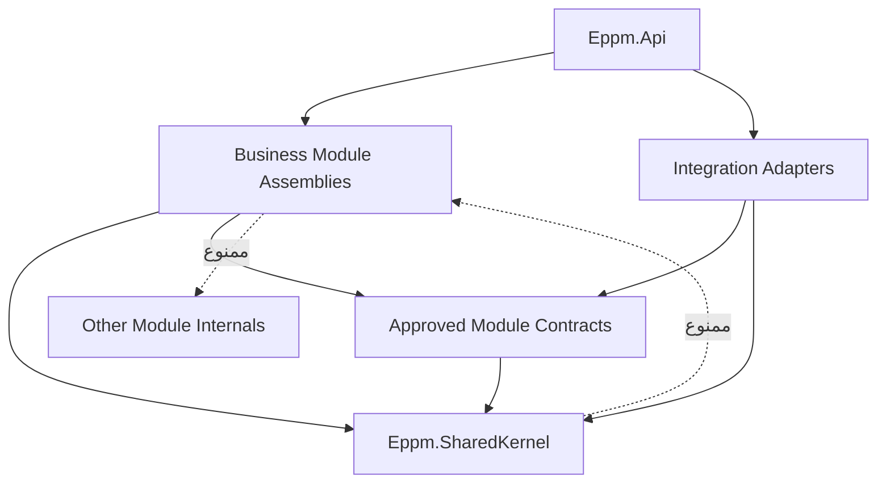
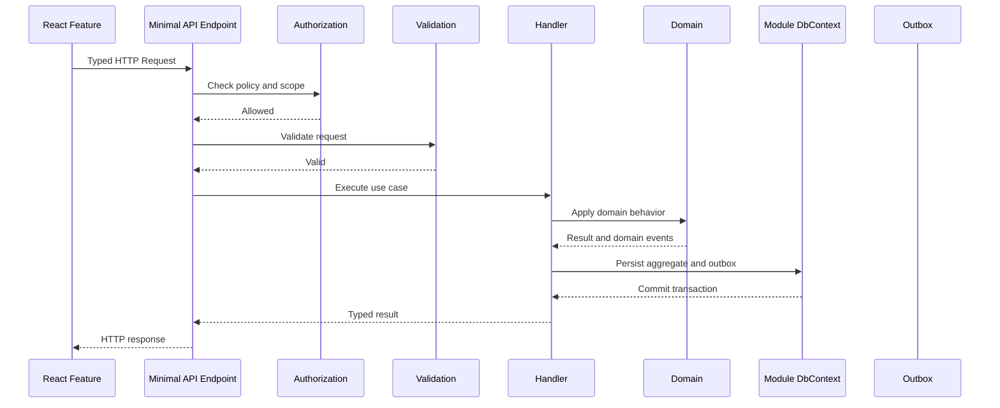
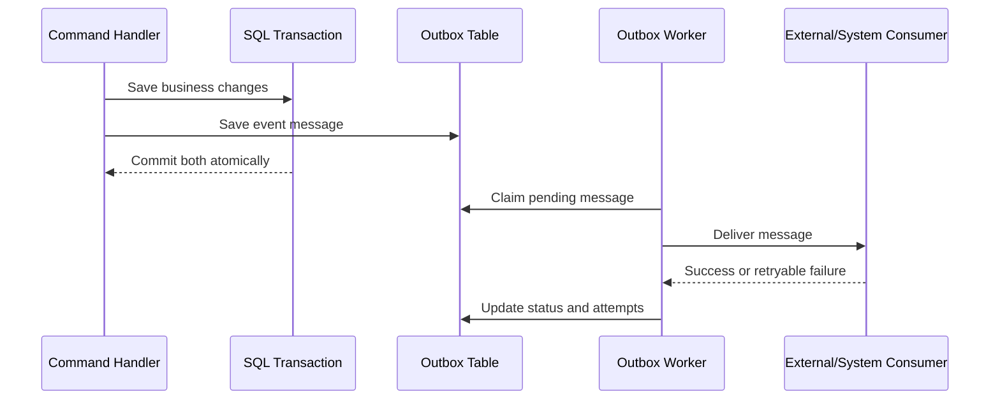

# معمارية التطبيق

## الغرض

توثق هذه الوثيقة البنية الداخلية القابلة للتنفيذ لمنصة إدارة المشاريع المؤسسية لصندوق البيئة، وتحوّل قرارات المكدس التقني والمعمارية العامة إلى قواعد واضحة لتنظيم الحل، ووحدات الأعمال، وVertical Slices، والعقود الداخلية، والوصول إلى البيانات، والمعاملات، والأحداث، والتكاملات، والواجهة الأمامية، والاختبارات.

لا تمثل هذه الوثيقة تنفيذًا فعليًا أو موافقة على بدء التطوير. جميع عناصر سجل الأعمال ما زالت غير جاهزة للتنفيذ إلى أن تكتمل المتطلبات، ومعايير القبول، وتصاميم البيانات والتكامل والأمن وتجربة المستخدم، وخطة الاختبار.

## معلومات الوثيقة

| الحقل | القيمة |
|---|---|
| المشروع | منصة إدارة المشاريع المؤسسية لصندوق البيئة |
| الاسم الإنجليزي | Environment Fund Enterprise Project Management Platform |
| نوع الوثيقة | Application Architecture |
| مالك الوثيقة | TBD — يحدد من صندوق البيئة |
| أُعدت بواسطة | تحليل نظم ومعمارية تطبيقات بمساعدة الذكاء الاصطناعي وتحت توجيه المستخدم |
| المراجعون | TBD — معمارية المؤسسة والتطبيقات والأمن والبيانات والتكامل والتشغيل والجودة |
| الإصدار | 0.2 |
| الحالة | Draft |
| التصنيف | Internal |
| آخر تحديث | 2026-07-18 |

## السياق المطلوب

1. `docs/00-Project-Index.md`
2. `docs/01-Requirements/03-System-Requirements.md`
3. `docs/01-Requirements/04-Delivery-Backlog.md`
4. `docs/01-Requirements/05-Traceability-Matrix.md`
5. `docs/02-Solution-Design/00-Technology-Stack.md`
6. `docs/02-Solution-Design/01-Solution-Overview-and-Architecture.md`
7. وثائق البيانات والتكامل والأمن وUI/UX عند إعدادها

## 1. نطاق الوثيقة وحالة القرارات

### 1.1 ما تغطيه الوثيقة

تغطي الوثيقة:

- بنية المستودع والحل ومشاريع .NET وتطبيق React؛
- وحدات الأعمال وحدود الملكية والتبعيات المسموحة؛
- تنظيم Vertical Slices للأوامر والاستعلامات؛
- Domain Model والعقود والأحداث الداخلية؛
- الوصول إلى SQL Server وحدود المعاملات والتزامن؛
- Transactional Outbox والمهام الخلفية؛
- API وOpenAPI والتحقق والأخطاء؛
- المصادقة والتفويض والتدقيق؛
- Adapters الخاصة بـOracle Fusion وEntra ID وExchange؛
- بنية React وإدارة الحالة والنماذج والتوجيه؛
- المراقبة والتهيئة والتخزين المؤقت وFeature Flags؛
- حدود الاختبارات وقواعد الحزم والكود المولد؛ و
- الأسئلة والمخاطر التي تمنع اعتبار التصميم جاهزًا للتنفيذ.

### 1.2 ما لا تغطيه الوثيقة

لا تعتمد هذه الوثيقة:

- منصة الاستضافة أو Topology الإنتاج؛
- عقد API تفصيليًا لكل Endpoint؛
- جداول قاعدة البيانات والحقول والفهارس النهائية؛
- واجهات Oracle Fusion أوMicrosoft Graph وصلاحياتها النهائية؛
- مصفوفة الأدوار والصلاحيات التفصيلية؛
- تصميم الشاشات والتدفقات المرئية؛
- قيم الأداء والتوافر وRPO وRTO؛
- منصة CI/CD أوالتسجيل أوTelemetry backend؛ أو
- أي حزمة خارجية لم تعتمد في وثيقة المكدس التقني أوADR لاحق.

### 1.3 حالات القرار

| الحالة | المعنى |
|---|---|
| Confirmed | قرار صريح ومعتمد في الوثائق الحالية |
| Proposed | تصميم مبدئي يحتاج مراجعة معمارية وأصحاب المصلحة |
| Open | قرار لم يحسم ويمنع تفاصيل لاحقة |
| Out of Scope | غير داخل نطاق الحل الحالي |

## 2. خط الأساس المعماري الملزم

| المجال | القرار | الحالة |
|---|---|---|
| نوع التطبيق | React SPA + ASP.NET Core API + SQL Server | Confirmed |
| نمط الحل | Modular Monolith | Confirmed |
| تنظيم الخادم | Business Modules تحتوي Vertical Slices | Confirmed |
| تنظيم الواجهة | Feature-based ومتوافق مع وحدات الأعمال | Confirmed |
| API | Minimal APIs وRoute Groups وTyped Results | Confirmed |
| الأوامر والاستعلامات | CQRS-lite دون فرض MediatR | Confirmed |
| الوصول للبيانات | EF Core مباشرة دون Generic Repository | Confirmed |
| قاعدة البيانات | SQL Server واحدة مبدئيًا مع Schema لكل وحدة | Confirmed |
| التكامل الموثوق | Transactional Outbox وIdempotency | Confirmed |
| التكاملات المباشرة | Oracle Fusion Cloud ERP وEntra ID وExchange فقط | Confirmed |
| لغة الواجهة | العربية RTL والإنجليزية LTR | Confirmed |
| الاستضافة | لم تحدد | Open |

## 3. مبادئ معمارية التطبيق

1. **القدرة قبل الطبقة:** تنظم الشفرة حول قدرات الأعمال وحالات الاستخدام، لا حول مجلدات تقنية عامة.
2. **ملكية واضحة:** كل وحدة تملك منطقها وبياناتها وتهيئتها وواجهاتها الداخلية.
3. **اعتماد أحادي الاتجاه:** لا تنشأ تبعيات دائرية بين الوحدات أوالمشاريع.
4. **أقل تجريد كافٍ:** لا تضاف طبقة أوواجهة أوحزمة دون حاجة مثبتة.
5. **العقود قبل التفاصيل:** تتعامل الوحدات عبر عقود مستقرة أوأحداث، لا عبر أنواعها الداخلية أوجداولها.
6. **الاتساق داخل الوحدة:** تحافظ العملية المحلية على معاملة واحدة عند الحاجة.
7. **اتساق نهائي بين الوحدات والأنظمة:** لا تستخدم معاملات موزعة بين الوحدات أوالأنظمة الخارجية.
8. **الأمن في الخادم:** الواجهة تحسن التجربة، لكن API يفرض المصادقة والتفويض والتحقق.
9. **قابلية الرصد افتراضيًا:** كل طلب ومعاملة وحدث وتكامل يحمل Correlation ID وسجلًا تشغيليًا مناسبًا.
10. **اختبار الحدود:** تفحص قواعد التبعيات والمعمارية آليًا ولا تترك للمراجعة اليدوية فقط.
11. **التدرج دون Microservices مبكرة:** يمكن فصل وحدة مستقبلًا فقط عند وجود مبرر تشغيلي مثبت.
12. **لا قرار ضمني:** أي حاجة غير محسومة تسجل كسؤال أوخطر ولا تحل بصمت أثناء البرمجة.

## 4. بنية المستودع والحل

### 4.1 بنية المستودع المقترحة

```text
/
├── src/
│   ├── Eppm.Api/
│   ├── Eppm.Modules/
│   ├── Eppm.Integrations/
│   ├── Eppm.SharedKernel/
│   ├── Eppm.ServiceDefaults/
│   └── Eppm.AppHost/
├── web/
│   ├── src/
│   ├── public/
│   └── tests/
├── tests/
│   ├── Eppm.ArchitectureTests/
│   ├── Eppm.FunctionalTests/
│   ├── Eppm.IntegrationTests/
│   └── Eppm.ContractTests/
├── docs/
├── scripts/
├── Directory.Build.props
├── Directory.Packages.props
├── global.json
├── package.json
├── pnpm-workspace.yaml
└── pnpm-lock.yaml
```

### 4.2 مشاريع .NET الأساسية

| المشروع | المسؤولية | يعتمد على |
|---|---|---|
| `Eppm.Api` | نقطة التشغيل، Middleware، المصادقة، OpenAPI، Health Checks وتسجيل الوحدات | عقود وتسجيل الوحدات والتكاملات |
| `Eppm.Modules.<Module>` | تنفيذ وحدة أعمال كاملة بحدود Assembly | Shared Kernel وعقود وحدات مصرح بها |
| `Eppm.Modules.<Module>.Contracts` | عقود عامة مستقرة لوحدة عند وجود مستهلكين من وحدات أخرى | Shared Kernel محدود |
| `Eppm.Integrations.OracleFusion` | Adapter وClients وMappings وResilience لـOracle | عقود التطبيق والبنية التحتية المشتركة |
| `Eppm.Integrations.MicrosoftEntra` | إعداد المصادقة وربط Claims والهوية الداخلية | ASP.NET Core وMicrosoft Identity |
| `Eppm.Integrations.MicrosoftExchange` | البريد والتقويم عبر Microsoft Graph | عقود الإشعارات والاجتماعات |
| `Eppm.SharedKernel` | Primitives صغيرة ومشتركة لا تخص مجالًا واحدًا | لا يعتمد على وحدات الأعمال |
| `Eppm.ServiceDefaults` | OpenTelemetry وHealth Checks وإعدادات التطوير المشتركة | حزم .NET المعتمدة |
| `Eppm.AppHost` | تنسيق بيئة التطوير المحلية فقط | مشاريع التشغيل والموارد المحلية |

### 4.3 قرار حجم المشاريع

لا يعتمد المشروع نمط أربعة مشاريع لكل وحدة من البداية مثل `Domain` و`Application` و`Infrastructure` و`Api`؛ لأن ذلك سيؤدي إلى عدد كبير من المشاريع والتبعيات دون قيمة مؤكدة.

الخط الأساس المقترح:

- Assembly واحدة لتنفيذ كل وحدة أعمال؛
- تنظيم داخلي واضح بالمجلدات وNamespaces؛
- مشروع `Contracts` مستقل فقط عندما تحتاج وحدة أخرى إلى عقد عام مستقر؛
- فصل إضافي إلى مشاريع مستقلة فقط عند وجود حاجة مثبتة للاختبار أوالملكية أوإعادة الاستخدام أوالعزل.

### 4.4 اتجاه التبعيات



### 4.5 قواعد المراجع بين المشاريع

- لا يشير مشروع وحدة إلى تنفيذ وحدة أخرى.
- يسمح بالإشارة إلى مشروع `Contracts` للوحدة المستهدفة عند وجود عقد مصرح به.
- لا يشير `SharedKernel` إلى أي وحدة أعمال أوتكامل.
- لا يشير تطبيق React إلى أنواع .NET يدويًا؛ يستخدم عقدًا مولدًا من OpenAPI.
- لا تعتمد Domain Types على ASP.NET Core أوEF Core أوMicrosoft Graph أوOracle SDK.
- لا يضاف `InternalsVisibleTo` إلا لمشروع اختبار الوحدة نفسه أوحالة موثقة.

## 5. وحدات الأعمال وحدود المسؤولية

الحدود التالية خط أساس مقترح يحتاج مراجعة أصحاب الأعمال. لا تمثل وحدات ترخيص أوفرقًا تنظيمية بالضرورة.

| الوحدة | المسؤولية الأساسية | متطلبات النظام | عناصر Backlog |
|---|---|---|---|
| Strategy | الأهداف والمبادرات والمواءمة والنتائج الاستراتيجية | FR-001–FR-010 | BI-001–BI-007 |
| DemandManagement | الطلبات والأفكار والفرص ودراسة الجدوى والتقييم والأولوية | FR-011–FR-036 | BI-008–BI-024 |
| PortfolioManagement | المحافظ والسيناريوهات والأولوية والأداء | FR-037–FR-048 | BI-025–BI-033 |
| ProgramManagement | البرامج والمكونات والتبعيات والمنافع المشتركة | FR-049–FR-058 | BI-034–BI-040 |
| ProjectManagement | تأسيس المشروع والنطاق والمتطلبات وWBS والجدول والمعالم | FR-059–FR-102 | BI-041–BI-066 |
| WorkManagement | المهام وKanban وAgile والعمل الهجين | FR-103–FR-118 | BI-067–BI-076 |
| ResourceManagement | الموارد والمهارات والطاقة والتخصيص والوقت | FR-119–FR-132 | BI-077–BI-086 |
| FinancialManagement | ميزانية المشروع والتكلفة والتوقع والتدفق وEVM | FR-133–FR-148 | BI-087–BI-096 |
| ProcurementAndContracts | المشتريات والعقود والموردون والاستلامات والمدفوعات المرجعية | FR-149–FR-164 | BI-097–BI-107 |
| DeliverablesAndQuality | المخرجات والمراجعة والقبول والجودة وعدم المطابقة | FR-165–FR-178 | BI-108–BI-116 |
| RiskAndIssues | المخاطر والقضايا والافتراضات والقيود والتبعيات والإجراءات | FR-179–FR-194 | BI-117–BI-126 |
| ChangeControl | طلبات التغيير وتحليل الأثر والاعتماد وخطوط الأساس | FR-195–FR-208 | BI-127–BI-134 |
| GovernanceAndMeetings | الاجتماعات واللجان والقرارات وأصحاب المصلحة والاتصالات والسجلات المعرفية | FR-209–FR-238 | BI-135–BI-152 |
| Reporting | تقارير الحالة واللوحات والتحليلات والتنبيهات | FR-239–FR-256 | BI-153–BI-163 |
| BenefitsManagement | المنافع والنتائج والقيمة والتقييم اللاحق والإغلاق والانتقال | FR-257–FR-276 | BI-164–BI-179 |
| Administration | الهوية الداخلية والصلاحيات والتهيئة والبيانات المرجعية وإدارة النظام | FR-277–FR-324 | BI-180–BI-208 |

القدرات الذكية `FR-325–FR-332` و`BI-209–BI-214` لا توضع داخل وحدة مستقلة قبل اعتماد حالات الاستخدام والبيانات والحوكمة. تنفذ كقدرات داخل الوحدة المالكة لحالة الاستخدام مع خدمات مشتركة محكومة عند الحاجة.

## 6. مصفوفة التبعيات المسموحة بين الوحدات

| الوحدة المستهلكة | الوحدة المالكة | نوع العلاقة المسموح | مثال |
|---|---|---|---|
| DemandManagement | Strategy | Query Contract | التحقق من الهدف المرتبط بالطلب |
| PortfolioManagement | DemandManagement | Event أوRead Contract | إدراج الطلب المعتمد في مرشح المحفظة |
| ProgramManagement | PortfolioManagement | Reference Contract | ربط البرنامج بمحفظة معتمدة |
| ProjectManagement | DemandManagement / ProgramManagement / PortfolioManagement | Reference Contract أوEvent | إنشاء مشروع من طلب أوبرنامج أوعنصر محفظة |
| WorkManagement | ProjectManagement | Reference Contract | التحقق من المشروع وWBS |
| ResourceManagement | ProjectManagement / WorkManagement | Read Contract أوEvent | التخصيص على مشروع أومهمة |
| FinancialManagement | ProjectManagement | Reference Contract | ربط الميزانية والتكلفة بالمشروع |
| ProcurementAndContracts | ProjectManagement / FinancialManagement | Reference Contract وEvents | ربط العقد والمشتريات بالمشروع والميزانية |
| DeliverablesAndQuality | ProjectManagement / ProcurementAndContracts | Reference Contract | ربط المخرج بالمشروع أوالعقد |
| RiskAndIssues | PortfolioManagement / ProgramManagement / ProjectManagement | Reference Contract | ربط الخطر بمستوى الإدارة المناسب |
| ChangeControl | ProjectManagement / FinancialManagement / ResourceManagement | Queries وEvents | تحليل أثر التغيير |
| GovernanceAndMeetings | جميع الوحدات | Generic Record Reference وEvents | اجتماع أوقرار مرتبط بسجل أعمال |
| Reporting | جميع الوحدات | Read Models وEvents | بناء لوحات وتقارير دون تعديل المصدر |
| BenefitsManagement | Strategy / ProgramManagement / ProjectManagement | Reference Contract وEvents | ربط المنفعة والنتيجة والإغلاق |
| Administration | جميع الوحدات | Configuration Contracts | القيم المرجعية والسياسات المهيأة |

### 6.1 ضوابط التبعيات

- لا تستخدم الوحدة `DbContext` وحدة أخرى.
- لا تستخدم Foreign Key مباشرة إلى جدول وحدة أخرى؛ تحفظ معرفًا مرجعيًا وتتحقق وفق العقد المعتمد.
- لا تعدل وحدة سجلًا تملكه وحدة أخرى.
- تستخدم القراءة المتزامنة فقط عندما يحتاج القرار الحالي إلى إجابة فورية ولا تكفي نسخة محلية.
- تستخدم الأحداث لتحديث النسخ المرجعية أوRead Models أوتشغيل إجراءات لاحقة.
- يجب أن يكون كل عقد مستقرًا ومحدودًا ولا يعرض Entity داخلية.

## 7. البنية الداخلية للوحدة

### 7.1 الهيكل المقترح

```text
Eppm.Modules.ProjectManagement/
├── Module.cs
├── Domain/
│   ├── Projects/
│   │   ├── Project.cs
│   │   ├── ProjectId.cs
│   │   ├── ProjectStatus.cs
│   │   ├── ProjectRules.cs
│   │   └── Events/
│   ├── WorkBreakdownStructures/
│   ├── Schedules/
│   └── Shared/
├── Features/
│   ├── CreateProject/
│   ├── UpdateProject/
│   ├── SubmitProjectForApproval/
│   ├── GetProjectDetails/
│   └── SearchProjects/
├── Contracts/
│   ├── IProjectReferenceReader.cs
│   └── Events/
├── Infrastructure/
│   ├── Persistence/
│   ├── Configuration/
│   ├── Projections/
│   └── Jobs/
└── Authorization/
```

### 7.2 مسؤوليات المجلدات

| المجلد | المسؤولية | لا يحتوي على |
|---|---|---|
| `Domain` | Aggregates وEntities وValue Objects والقواعد والأحداث | HTTP أوEF DbContext أوSDK خارجي |
| `Features` | Endpoints وRequests وResponses وHandlers والتحقق والتفويض | منطق مشترك غير مملوك للـFeature |
| `Contracts` | عقود القراءة والأحداث العامة المحدودة | Entities داخلية أوDbContext |
| `Infrastructure` | EF Core وConfigurations وRepositories متخصصة عند الحاجة وJobs | قرارات أعمال غير ممثلة في Domain أوFeature |
| `Authorization` | Policies ومتطلبات الوصول الخاصة بالوحدة | منطق عرض في React |

### 7.3 تسجيل الوحدة

كل وحدة توفر نقطة تسجيل واحدة للخدمات وEndpoints:

```csharp
public static class ProjectManagementModule
{
    public static IServiceCollection AddProjectManagement(
        this IServiceCollection services,
        IConfiguration configuration)
    {
        // Register module services and persistence.
        return services;
    }

    public static IEndpointRouteBuilder MapProjectManagement(
        this IEndpointRouteBuilder endpoints)
    {
        // Map module route groups and slices.
        return endpoints;
    }
}
```

لا يجب أن يحتوي `Program.cs` على تفاصيل كل Feature، بل ينسق تسجيل الوحدات والمكونات العامة فقط.

## 8. Vertical Slice Architecture

### 8.1 تعريف Slice

تمثل Slice حالة استخدام واحدة قابلة للتتبع مثل:

- إنشاء مشروع؛
- إرسال مشروع للاعتماد؛
- تسجيل خطر؛
- اعتماد طلب تغيير؛
- البحث عن العقود؛ أو
- عرض لوحة المحفظة.

يجب أن ترتبط Slice بمعرفات المتطلبات وعناصر Backlog ومعايير القبول عند جاهزيتها.

### 8.2 بنية Command Slice

```text
Features/
└── CreateProject/
    ├── Endpoint.cs
    ├── Request.cs
    ├── Response.cs
    ├── Validator.cs
    ├── Handler.cs
    ├── Authorization.cs
    ├── Mapping.cs
    └── Tests.cs
```

### 8.3 بنية Query Slice

```text
Features/
└── GetProjectDetails/
    ├── Endpoint.cs
    ├── Request.cs
    ├── Response.cs
    ├── Handler.cs
    ├── Projection.cs
    └── Tests.cs
```

لا تفرض ملفات فارغة على كل Slice. ينشأ الملف فقط عندما توجد مسؤولية فعلية.

### 8.4 تدفق الطلب



### 8.5 قواعد Endpoint

- يكون Endpoint رفيعًا ولا يحتوي منطق أعمال.
- يربط HTTP Request بالـHandler ويطبق Metadata وPolicies وTyped Results.
- لا يصل Endpoint مباشرة إلى `DbContext` في عمليات الأعمال المعقدة.
- يمكن للاستعلام البسيط استخدام Query Handler مباشر مع Projection.
- لا يعيد Endpoint Entity أوEF Tracking Object.
- يستخدم Cancellation Token في العمليات غير الفورية.
- يوثق OpenAPI بالاسم والوصف والاستجابات والأمن دون تكرار عقود يدوية.

### 8.6 قواعد Handler

- ينفذ حالة استخدام واحدة.
- ينسق القراءة والتغيير والتحقق من العقود الخارجية المطلوبة.
- يستدعي سلوك Domain بدل تعديل خصائص Aggregate بصورة عشوائية.
- لا ينشئ معاملة موزعة أوينادي نظامًا خارجيًا داخل معاملة SQL.
- يعيد Result واضحًا يمكن تحويله إلى HTTP Response.
- يسجل أحداث Outbox ضمن المعاملة عندما يلزم إجراء لاحق موثوق.

### 8.7 CQRS-lite

- تستخدم Commands للعمليات التي تغير الحالة.
- تستخدم Queries للقراءة دون آثار جانبية.
- لا يفرض Event Sourcing.
- لا يفرض Read Database مستقلة.
- يمكن استخدام جداول Projection داخل SQL Server نفسه للتقارير والقراءات الثقيلة.
- لا يستخدم MediatR افتراضيًا؛ يستدعي Endpoint الـHandler مباشرة عبر Dependency Injection.

## 9. نموذج النطاق Domain Model

### 9.1 العناصر الأساسية

| العنصر | الاستخدام |
|---|---|
| Aggregate Root | يحمي مجموعة قواعد واتساق داخل حد معاملة واحد |
| Entity | كيان له هوية ودورة حياة ضمن Aggregate أووحدة |
| Value Object | قيمة غير معرفة بالهوية وتتحقق من صحتها عند الإنشاء |
| Domain Service | قاعدة مجال لا تنتمي طبيعيًا إلى Aggregate واحد |
| Domain Event | حقيقة حدثت داخل المجال وتحتاج استجابة داخلية |
| Specification / Policy | قاعدة مركبة قابلة لإعادة الاستخدام عند وجود حاجة مثبتة |

### 9.2 ضوابط Aggregate

- لا ينشأ Aggregate ضخم يغطي دورة المشروع كاملة.
- يحدد حد Aggregate وفق الاتساق الفوري وليس وفق شاشة أوجدول.
- لا تعرض Collections الداخلية للتعديل المباشر.
- تمر تغييرات الحالة من Methods ذات معنى أعمال.
- تحفظ Invariants داخل Domain أوHandler عندما تعتمد على مصادر خارج Aggregate.
- تستخدم Optimistic Concurrency للسجلات التي قد يعدلها أكثر من مستخدم.

### 9.3 Value Objects

أمثلة مرشحة تحتاج تصميم بيانات تفصيليًا:

- معرف المشروع؛
- فترة زمنية؛
- مبلغ وعملة؛
- نسبة مئوية؛
- رمز حالة؛
- تصنيف أولوية؛ و
- مرجع سجل خارجي.

لا ينشأ Value Object لمجرد تغليف كل نوع بدائي؛ يجب أن يحمل تحققًا أوسلوكًا أومعنى مجال واضحًا.

### 9.4 Domain Events

- تمثل حدثًا بصيغة الماضي مثل `ProjectCreated` أو`ChangeRequestApproved`.
- تنشأ بواسطة Domain ولا ترسل مباشرة إلى نظام خارجي.
- تعالج بعد نجاح المعاملة أوتحول إلى Internal Event / Integration Event عبر Outbox.
- لا تحمل Entity كاملة؛ تحمل معرفات وقيمًا ضرورية فقط.

## 10. العقود والتواصل بين الوحدات

### 10.1 أنواع العقود

| النوع | الاستخدام | الاتساق |
|---|---|---|
| Reference Reader | قراءة مرجع محدود لاتخاذ قرار فوري | متزامن |
| Query Contract | استعلام داخلي عن بيانات محددة | متزامن |
| Internal Event | إشعار وحدات أخرى بحدث داخل المنصة | غير متزامن غالبًا |
| Integration Event | تواصل مع نظام خارجي | غير متزامن وموثوق |
| Read Model | نسخة محسنة للقراءة والتقارير | اتساق نهائي |

### 10.2 مثال عقد قراءة

```csharp
public interface IProjectReferenceReader
{
    Task<ProjectReference?> GetAsync(
        ProjectId projectId,
        CancellationToken cancellationToken);
}

public sealed record ProjectReference(
    Guid Id,
    string Code,
    string Name,
    string Status);
```

العقد لا يعرض `Project` Aggregate ولا`ProjectDbContext` ولاتفاصيل جداول الوحدة.

### 10.3 قواعد الاتصال المتزامن

- يستخدم عندما تتطلب العملية الحالية قرارًا فوريًا.
- يعيد أقل بيانات لازمة.
- يمنع سلسلة طويلة من الاستدعاءات بين الوحدات.
- يجب ألا يؤدي إلى تعديل في الوحدة المالكة من خلال Query Contract.
- توثق حالات الفشل والمهلة والسلوك البديل.

### 10.4 قواعد الأحداث الداخلية

- تستخدم لإجراءات لاحقة لا يجب أن تمنع العملية الأصلية.
- تحفظ في Outbox مع معاملة المصدر عندما يجب ألا تضيع.
- يكون المستهلك Idempotent.
- يسجل رقم المحاولة والخطأ والوقت والحالة.
- لا يفترض ترتيب عالمي للأحداث؛ يوثق الترتيب المطلوب لكل Stream عند الحاجة.

## 11. الوصول للبيانات والمعاملات

### 11.1 DbContext لكل وحدة

يفضل DbContext مستقل لكل وحدة:

```text
StrategyDbContext
DemandManagementDbContext
PortfolioManagementDbContext
ProgramManagementDbContext
ProjectManagementDbContext
WorkManagementDbContext
ResourceManagementDbContext
FinancialManagementDbContext
ProcurementAndContractsDbContext
DeliverablesAndQualityDbContext
RiskAndIssuesDbContext
ChangeControlDbContext
GovernanceAndMeetingsDbContext
ReportingDbContext
BenefitsManagementDbContext
AdministrationDbContext
```

لا يعني ذلك قواعد بيانات منفصلة. يمكن لكل DbContext استخدام قاعدة SQL Server نفسها مع Schema مملوك للوحدة.

### 11.2 ملكية Schema

| الوحدة | Schema المقترح |
|---|---|
| Strategy | `strategy` |
| DemandManagement | `demand` |
| PortfolioManagement | `portfolio` |
| ProgramManagement | `program` |
| ProjectManagement | `project` |
| WorkManagement | `work` |
| ResourceManagement | `resource` |
| FinancialManagement | `finance` |
| ProcurementAndContracts | `procurement` |
| DeliverablesAndQuality | `quality` |
| RiskAndIssues | `risk` |
| ChangeControl | `change` |
| GovernanceAndMeetings | `governance` |
| Reporting | `reporting` |
| BenefitsManagement | `benefits` |
| Administration | `admin` |

الأسماء نهائية فقط بعد تصميم البيانات ومراجعة معايير SQL Server والصندوق.

### 11.3 قواعد EF Core

- تستخدم Fluent Configuration لكل Entity معقدة.
- لا تعتمد Lazy Loading.
- تستخدم `AsNoTracking` للاستعلامات التي لا تعدل البيانات.
- تستخدم Projections مباشرة إلى Response DTOs للقراءات.
- تمنع N+1 Queries وتراجع SQL وخطط التنفيذ للعمليات الحرجة.
- تستخدم Server-side Pagination وFiltering وSorting.
- لا تحمل مجموعة مؤسسية كاملة إلى الذاكرة أوالمتصفح.
- لا يستخدم EF Core InMemory Provider لإثبات توافق استعلامات SQL Server.
- لا تنفذ Migrations تلقائيًا عند تشغيل الإنتاج.

### 11.4 حدود المعاملة

- Command واحد يملك معاملة وحدة واحدة افتراضيًا.
- تحفظ تغييرات Aggregate وOutbox في المعاملة نفسها.
- لا يشمل Transaction استدعاء Oracle أوMicrosoft Graph.
- لا تستخدم Distributed Transactions بين الوحدات أوالأنظمة.
- إذا احتاجت عملية إلى عدة وحدات، تقسم إلى خطوات وأحداث وتعويضات موثقة.
- العمليات التي تتطلب اتساقًا فوريًا عبر عدة وحدات تحتاج مراجعة حدود الوحدات قبل التنفيذ.

### 11.5 التزامن

- تستخدم `rowversion` أوConcurrency Token للسجلات الحساسة.
- يعاد HTTP Conflict أوPrecondition Failure وفق تصميم API عند اكتشاف تعديل متزامن.
- يعرض للمستخدم سياق مناسب لإعادة التحميل أوالمقارنة، ولا يطغى على تعديل آخر بصمت.
- لا تعاد المحاولة تلقائيًا في تعارض أعمال دون فهم أثرها.

### 11.6 المعرفات والوقت

- تستخدم معرفات لا يعاد استخدامها.
- يحدد نوع المعرف النهائي في تصميم البيانات.
- تحفظ الأوقات بصيغة UTC.
- يطبق العرض حسب المنطقة الزمنية واللغة في React.
- تسجل أوقات الإنشاء والتعديل والفاعل وفق تصميم التدقيق.

## 12. Transactional Outbox والمهام الخلفية

### 12.1 تدفق Outbox



### 12.2 أنواع المهام الخلفية المتوقعة

- نشر Outbox Events؛
- مزامنة بيانات Oracle وفق التصميم المعتمد؛
- إرسال إشعارات البريد والتقويم؛
- إعادة المحاولة والتسوية؛
- تحديث Read Models أوProjections؛
- تنفيذ تذكيرات وتصعيدات مجدولة؛
- تطبيق سياسات الاحتفاظ أوالتنظيف بعد اعتمادها؛ و
- مراقبة Dead-letter أوPoison Messages.

### 12.3 ضوابط Workers

- تكون Idempotent.
- تستخدم Lock أوClaim آمنًا عند تشغيل أكثر من Instance.
- تسجل Correlation ID وMessage ID ومحاولات التنفيذ.
- تصنف الأخطاء إلى مؤقتة ودائمة.
- لا تعيد المحاولة بلا حد.
- تنتقل الرسالة الفاشلة إلى حالة تحتاج معالجة تشغيلية.
- لا تحذف الأدلة التاريخية للفشل أوإعادة التشغيل.

لا يعتمد Hangfire أوQuartz أوأي Scheduler خارجي قبل إثبات الحاجة واختيار الأداة في ADR.

## 13. معمارية API

### 13.1 مبادئ API

- API هي الحد الأمني والتنفيذي للواجهة.
- تستخدم JSON وعقودًا صريحة.
- يستخدم OpenAPI الرسمي في ASP.NET Core كمصدر لتوليد عميل TypeScript.
- لا ينشأ Model يدوي في React عندما يمكن توليده من العقد.
- لا يعرض API أسماء جداول أوتفاصيل EF Core.
- يجب أن تكون العمليات Idempotent عندما يتوقع تكرار الطلب.
- تستخدم Versioning strategy بعد اعتمادها في تصميم API التفصيلي.

### 13.2 Route Groups

تنظم Routes حسب الوحدة والقدرة، وليس حسب Controller عام:

```csharp
var group = endpoints
    .MapGroup("/api/projects")
    .WithTags("Projects")
    .RequireAuthorization();

CreateProjectEndpoint.Map(group);
GetProjectDetailsEndpoint.Map(group);
SearchProjectsEndpoint.Map(group);
```

المسار النهائي وسياسة Versioning ما زالا مفتوحين ولا يعد المثال عقدًا نهائيًا.

### 13.3 Typed Results

يجب أن توثق كل عملية الاستجابات المتوقعة مثل:

- نجاح مع Response محدد؛
- Validation Problem؛
- Unauthorized؛
- Forbidden؛
- Not Found؛
- Conflict؛ و
- Problem Detail غير متوقع.

### 13.4 Pagination والبحث

- ينفذ Pagination في الخادم.
- يحدد Offset أوCursor حسب طبيعة البيانات والتغيير المتزامن.
- يحدد Sort قابلًا للضبط ومحدودًا بقائمة حقول مسموحة.
- تمنع الفلاتر الحرة التي تتحول إلى SQL غير منضبط.
- تحدد حدود حجم الصفحة في NFR وتصميم API.

### 13.5 رفع وتنزيل الملفات

تكنولوجيا تخزين الملفات لم تعتمد بعد. إلى حين اعتمادها:

- لا تحفظ ملفات كبيرة داخل جداول الأعمال دون قرار؛
- تتحقق الأنواع والأحجام والأسماء والمحتوى وفق سياسة الأمن؛
- لا يثق النظام في MIME Type القادم من المتصفح؛
- تستخدم روابط مؤقتة أوبثًا آمنًا وفق التصميم؛
- تسجل عمليات الرفع والتنزيل والحذف؛ و
- تمنع Path Traversal وتنفيذ الملفات.

## 14. التحقق والأخطاء

### 14.1 طبقات التحقق

| الطبقة | نوع التحقق |
|---|---|
| React | تحسين تجربة المستخدم والتحقق المبكر |
| API Request | الشكل والأنواع والحقول المطلوبة والحدود الأساسية |
| Handler | قواعد الحالة والسياق والعقود مع الوحدات الأخرى |
| Domain | Invariants التي يجب ألا تنكسر بغض النظر عن نقطة الاستدعاء |
| Database | Constraints وفهارس فريدة وسلامة تخزين |
| Integration | Contract وMapping وSchema وIdempotency |

لا يكتفى بالتحقق في React؛ جميع قواعد الأمان والأعمال تفرض في الخادم.

### 14.2 مكتبات التحقق

- يستخدم `Microsoft.Extensions.Validation` للقواعد البسيطة المتوافقة.
- يستخدم FluentValidation 12.x فقط عندما تكون القواعد المركبة أوإعادة الاستخدام تستحقه.
- لا تستخدم `FluentValidation.AspNetCore` القديمة.
- لا تكرر القاعدة نفسها في عدة Validators دون مصدر واضح.

### 14.3 نموذج الأخطاء

يستخدم RFC Problem Details مع حقول إضافية محكومة:

```json
{
  "type": "https://errors.ef.gov.sa/project/project-not-found",
  "title": "Project not found",
  "status": 404,
  "code": "PROJECT_NOT_FOUND",
  "traceId": "00-..."
}
```

اسم النطاق وروابط أنواع الأخطاء تحتاج اعتمادًا قبل التنفيذ.

### 14.4 رموز الأخطاء

- يكون لكل خطأ أعمال مستقر Code لا يعتمد على النص المترجم.
- يترجم React الرسالة المناسبة باستخدام Code والسياق الآمن.
- لا يعرض Stack Trace أوSQL أوToken أوتفاصيل داخلية للمستخدم.
- يسجل الخطأ الكامل داخليًا وفق التصنيف وسياسة الخصوصية.

## 15. المصادقة والتفويض

### 15.1 المصادقة

- يستخدم Microsoft Entra ID للـSSO.
- يستخدم React MSAL بالتدفق المعتمد للتطبيق العام.
- يتحقق ASP.NET Core من Access Token وIssuer وAudience وLifetime وSignature.
- لا يثق النظام في Claims غير موثقة في تصميم الهوية.
- يربط معرف Entra بحساب مستخدم داخلي عند الحاجة لصلاحيات الأعمال والتدقيق.

### 15.2 التفويض

يطبق التفويض على مستويات:

1. صلاحية استخدام Feature؛
2. دور أوPolicy؛
3. نطاق البيانات؛
4. حالة السجل؛
5. فصل المهام؛
6. التفويض المؤقت؛ و
7. قيود الإجراء أوالاعتماد.

### 15.3 Policy-based Authorization

- تعرّف Policies بأسماء أعمال مستقرة.
- لا توزع Strings للصلاحيات في جميع الملفات.
- يمكن للـHandler إعادة التحقق من صلاحية مرتبطة بالسجل.
- لا يعد إخفاء Route أوزر في React تفويضًا.
- تسجل محاولات الوصول المرفوضة وفق سياسة التدقيق والأمن.

### 15.4 الحسابات الخدمية

- تستخدم Managed Identity أوSecret/Certificate محمي حسب منصة الاستضافة والأنظمة الخارجية.
- لا تحفظ Client Secrets في الشفرة أوملفات Frontend.
- تطبق أقل صلاحية وتدوير الأسرار.
- تفصل هويات الخدمات عن هويات المستخدمين.

## 16. التدقيق والسجلات

### 16.1 أنواع السجلات

| النوع | الغرض |
|---|---|
| Business Audit | من فعل ماذا على سجل أعمال ومتى ولماذا |
| Security Audit | الدخول والتفويض وتغيير الصلاحيات والوصول الحساس |
| Integration Audit | الرسائل والمزامنة والتسوية والأخطاء وإعادة التشغيل |
| Operational Log | تشخيص الأداء والأخطاء والصحة |

### 16.2 ضوابط التدقيق

- لا يستبدل Application Log سجل التدقيق.
- يكون سجل التدقيق غير قابل للتعديل من المستخدم العادي.
- تحفظ القيم السابقة واللاحقة فقط عند الحاجة والسياسة.
- تخفى البيانات الحساسة والأسرار.
- يستخدم Correlation ID للربط بين طلب المستخدم والمعاملة والحدث والتكامل.
- تحدد مدة الاحتفاظ والوصول والتصدير في تصميم الأمن والسجلات.

## 17. معمارية التكامل داخل التطبيق

### 17.1 قاعدة أساسية

لا يتصل React مباشرة بـOracle Fusion أوMicrosoft Graph. جميع التكاملات تمر عبر ASP.NET Core Adapters وخدمات خلفية محكومة.

### 17.2 Oracle Fusion Adapter

```text
Eppm.Integrations.OracleFusion/
├── Authentication/
├── Clients/
├── Contracts/
├── Mapping/
├── Resilience/
├── Reconciliation/
├── Diagnostics/
└── Jobs/
```

الـAdapter مسؤول عن:

- المصادقة التقنية؛
- استدعاء العقود المعتمدة؛
- Mapping بين Oracle والنموذج الداخلي؛
- Retry وTimeout وCircuit Breaker؛
- Idempotency؛
- التسوية وحداثة البيانات؛
- التسجيل وإخفاء البيانات الحساسة؛ و
- تحويل أخطاء النظام الخارجي إلى نتائج داخلية مفهومة.

لا يحدد هذا الملف REST أوSOAP أوBICC أوأي وسيلة أخرى قبل تصميم التكامل التفصيلي.

### 17.3 Entra Adapter

يغطي:

- إعداد Authentication؛
- Token Validation؛
- Claim Mapping؛
- ربط المستخدم الداخلي؛
- App Roles أوScopes عند اعتمادها؛ و
- سياسات الجلسة والخروج وفق تصميم الأمن.

لا يفترض مزامنة المستخدمين أوGroups أوالهيكل التنظيمي دون قرار صريح.

### 17.4 Exchange Adapter

```text
Eppm.Integrations.MicrosoftExchange/
├── GraphClient/
├── Mail/
├── Calendar/
├── Templates/
├── Resilience/
├── Diagnostics/
└── Jobs/
```

يغطي:

- إرسال البريد؛
- إنشاء وتحديث وإلغاء الاجتماعات؛
- إنشاء أحداث التقويم المعتمدة؛
- حفظ معرف الرسالة أوالحدث عند الحاجة؛
- Retry وThrottling وIdempotency؛ و
- تسجيل التسليم والفشل دون حفظ محتوى حساس غير مطلوب.

نموذج الصلاحيات Application أوDelegated والـMailbox المرسل لم يعتمد بعد.

## 18. معمارية React التطبيقية

### 18.1 البنية

```text
web/src/
├── app/
│   ├── bootstrap/
│   ├── providers/
│   ├── router/
│   ├── layouts/
│   ├── auth/
│   ├── error-boundaries/
│   └── configuration/
├── modules/
│   ├── projects/
│   ├── portfolios/
│   ├── programs/
│   ├── resources/
│   ├── finance/
│   ├── contracts/
│   ├── risks/
│   └── administration/
├── shared/
│   ├── ui/
│   ├── api/
│   ├── localization/
│   ├── validation/
│   ├── utilities/
│   └── types/
├── styles/
└── main.tsx
```

### 18.2 بنية وحدة Frontend

```text
modules/projects/
├── index.ts
├── routes.tsx
├── features/
│   ├── create-project/
│   ├── edit-project/
│   ├── submit-project/
│   └── close-project/
├── pages/
├── components/
├── api/
├── schemas/
├── hooks/
├── types/
└── tests/
```

### 18.3 Public API للوحدة

- تصدر الوحدة Routes ومكونات أوعقودًا محددة من `index.ts`.
- لا تستورد وحدة ملفات داخلية عميقة من وحدة أخرى.
- تمنع Circular Dependencies آليًا.
- لا ينقل منطق أعمال إلى `shared` لتجنب تحديد المالك.

### 18.4 عميل API

- يولد TypeScript Client من OpenAPI.
- تغلف الوحدة العمليات المولدة في Query/Mutation Hooks ذات معنى أعمال.
- لا تنفذ المكونات `fetch` مباشرة.
- لا يستخدم Axios افتراضيًا؛ يستخدم Native Fetch من خلال العميل المولد أوWrapper موحد.
- لا توضع Tokens أوSecrets في Parameters أوLogs.

### 18.5 إدارة الحالة

| نوع الحالة | الأداة | القاعدة |
|---|---|---|
| Server State | TanStack Query | لا يكرر في Zustand أوContext |
| URL State | React Router | للفلاتر والفرز والصفحات القابلة للمشاركة |
| Form State | React Hook Form | محلي للنموذج |
| Runtime Validation | Zod | للحدود الخارجية والنماذج عند الحاجة |
| Local UI State | `useState` / `useReducer` | أقرب مكون مالك |
| Shared UI State | Zustand عند الحاجة | لا يحتوي بيانات API |
| Derived State | Selector أوحساب أثناء العرض | لا يخزن كنسخة ثانية |

### 18.6 Query Keys

- تملك كل وحدة Factory موحدة لـQuery Keys.
- لا تستخدم Strings عشوائية موزعة.
- تنفذ Invalidation وفق أثر Mutation الفعلي.
- لا يمسح Cache كاملًا بعد كل تعديل.
- تضبط Stale Time وRetry حسب طبيعة البيانات لا بصورة عامة لكل النظام.

### 18.7 النماذج

- تستخدم React Hook Form للنماذج المعقدة.
- تستخدم Zod Schema عندما تحتاج تحققًا مشتركًا أوParsing لمدخل خارجي.
- تعرض أخطاء الحقول وأخطاء الأعمال العامة بصورة منفصلة.
- تحفظ Draft محلي أوخادمي فقط عند وجود متطلب موثق.
- تحذر من فقدان التعديلات غير المحفوظة في التدفقات المناسبة.
- لا ترسل حقولًا مخفية أوغير مصرح بها اعتمادًا على الواجهة فقط.

### 18.8 حالات الواجهة الإلزامية

كل صفحة أوFeature تتعامل حسب انطباقها مع:

- Initial loading؛
- Background refreshing؛
- Empty state؛
- No search results؛
- Validation error؛
- Forbidden؛
- Not found؛
- Dependency unavailable؛
- Unexpected error؛
- Success confirmation؛ و
- Optimistic concurrency conflict.

### 18.9 التوجيه والتحميل الكسول

- يعرف Router مركزيًا ويجمع Routes التي تملكها الوحدات.
- تستخدم Route-level Code Splitting للوحدات والصفحات الكبيرة.
- لا يحمل النظام جميع اللوحات والمحررات عند بدء التطبيق.
- تطبق Error Boundary على مستوى التطبيق والوحدة والمسارات الحرجة.
- تحفظ صلاحيات Route كتجربة استخدام فقط ويظل API صاحب القرار الأمني.

### 18.10 التعريب وإمكانية الوصول

- تستخدم مفاتيح ترجمة مستقرة لا نصوصًا إنجليزية كمعرفات.
- يختبر RTL وLTR في المكونات والتدفقات الأساسية.
- تستخدم CSS Logical Properties وTailwind utilities المتوافقة.
- تستخدم Semantic HTML قبل ARIA.
- تدعم Keyboard وFocus Management وScreen Reader.
- لا يعتمد اللون وحده لإيصال الحالة.
- توثق صياغة التاريخ والوقت والأرقام والعملات حسب اللغة والمنطقة.

## 19. Cross-Cutting Concerns

### 19.1 التهيئة

- تستخدم Options Pattern في .NET.
- تتحقق الإعدادات المهمة عند بدء التشغيل.
- تفصل إعدادات كل وحدة وتكامل.
- لا تحفظ أسرارًا في ملفات المستودع.
- توثق القيم المطلوبة لكل بيئة دون كشف القيم السرية.

### 19.2 التسجيل والتتبع

- تستخدم Structured Logging.
- تربط Logs وTraces وMetrics بـCorrelation ID.
- لا تسجل Request/Response Bodies الحساسة افتراضيًا.
- تضيف Attributes للوحدة والـFeature والنتيجة والمدة.
- تستخدم OpenTelemetry Instrumentation للـHTTP وASP.NET Core وSQL والتكاملات وفق التصميم.

### 19.3 Health Checks

تفصل بين:

- Liveness: العملية تعمل؛
- Readiness: الاعتماديات الضرورية تسمح باستقبال العمل؛
- Dependency health: SQL وOracle وGraph والـWorkers؛ و
- Business freshness: حداثة المزامنة أوProjections عند الحاجة.

لا يجعل فشل نظام غير ضروري كل التطبيق غير جاهز دون تحليل أثره.

### 19.4 التخزين المؤقت

- لا يضاف Cache قبل وجود حاجة قابلة للقياس.
- لا يخزن قرار تفويض حساس دون سياسة إبطال واضحة.
- يحدد المالك والمفتاح والمدة والإبطال والحجم لكل Cache.
- يمكن استخدام HybridCache عند اعتماد الحاجة.
- لا يستخدم Cache لإخفاء استعلام سيئ أوغياب Index.

### 19.5 Feature Flags

- تستخدم فقط لإطلاق تدريجي أومخاطر تشغيلية موثقة.
- لا تستبدل صلاحيات الأعمال.
- يكون لكل Flag مالك وتاريخ إزالة وحالة افتراضية.
- لا تترك Flags دائمة دون مراجعة.
- مزود Feature Flags لم يعتمد بعد.

### 19.6 Rate Limiting والحماية

- يطبق Rate Limiting وفق نوع المستخدم والعملية والتكامل بعد تحديد NFRs.
- تحدد Limits للبحث والتصدير والرفع والتكاملات الحساسة.
- لا تستخدم قيمة موحدة لكل العمليات دون تحليل.
- تسجل عمليات الحجب المتكررة وتراقب.

## 20. الاختبارات وحدود الجودة

### 20.1 هرم الاختبارات

| المستوى | الغرض |
|---|---|
| Domain Unit Tests | قواعد المجال والحالات والانتقالات |
| Slice Tests | Handler والتحقق والتفويض والنتائج |
| Module Integration Tests | EF Core وSQL Server وOutbox داخل الوحدة |
| Functional API Tests | HTTP كامل من Endpoint إلى قاعدة البيانات |
| Contract Tests | OpenAPI وOracle وMicrosoft Graph والعقود الداخلية |
| Architecture Tests | حدود المشاريع والوحدات وNamespaces |
| Frontend Component Tests | سلوك المكونات والنماذج والحالات |
| End-to-End Tests | التدفقات الحرجة عبر React وAPI |

### 20.2 اختبارات المعمارية

يجب أن تتحقق آليًا من أن:

- Shared Kernel لا يعتمد على الوحدات؛
- Domain لا يعتمد على Infrastructure أوASP.NET Core؛
- وحدة لا تعتمد على Implementation وحدة أخرى؛
- Endpoints لا تعيد Entities؛
- لا توجد Circular Dependencies؛
- التكاملات الخارجية لا تستدعى من React؛
- أسماء Features وNamespaces تتبع القواعد؛ و
- العقود العامة موجودة في المواقع المسموحة فقط.

أداة الاختبار المعماري لم تعتمد بعد، ويمكن تقييم `NetArchTest.Rules` أو`ArchUnitNET` أوفحوص Roslyn مخصصة قبل الاختيار.

### 20.3 اختبارات قاعدة البيانات

- تستخدم SQL Server فعليًا داخل Container أوبيئة اختبار معزولة للعمليات المهمة.
- تعزل بيانات كل اختبار.
- تختبر Migrations وConstraints وConcurrency وOutbox.
- لا يعد EF InMemory بديلًا لاختبار SQL Server.

### 20.4 اختبارات React

- Vitest لاختبارات الوحدة؛
- React Testing Library للسلوك؛
- MSW لمحاكاة API عند اختبار المكونات؛
- Playwright للتدفقات End-to-End؛
- axe-core مع اختبار يدوي لإمكانية الوصول؛ و
- اختبارات للعربية والإنجليزية وRTL وLTR.

## 21. قواعد الحزم والكود المولد

### 21.1 حزم .NET

- تدار الإصدارات مركزيًا في `Directory.Packages.props`.
- توحد حزم EF Core على Patch واحد.
- تمنع حزم Preview وBeta وRC في الإنتاج.
- تراجع الرخص والصيانة والثغرات قبل الإضافة.
- لا تضاف حزمة عندما تكفي قدرات .NET بصورة واضحة.

### 21.2 حزم Frontend

- يستخدم `pnpm` وملف قفل معتمد.
- يمنع النطاق `latest` في بناء قابل للإصدار.
- تستخدم Dependencies للإنتاج وDevDependencies للأدوات بدقة.
- تفحص الحزم للتراخيص والثغرات والاعتماديات المتروكة.
- لا تضاف مكتبتان تؤديان الوظيفة نفسها دون قرار.

### 21.3 الكود المولد

- يحفظ OpenAPI Client في مجلد واضح مثل `shared/api/generated`.
- لا يعدل الكود المولد يدويًا.
- يثبت إصدار أداة التوليد وإعداداتها.
- يفشل CI إذا تغير عقد OpenAPI ولم يحدث العميل عند الحاجة.
- يغلف الكود المولد بطبقة صغيرة خاصة بالوحدة بدل نشر تفاصيله في المكونات.

## 22. التسمية واتفاقيات التنفيذ

### 22.1 .NET

| العنصر | الاتفاقية |
|---|---|
| الوحدة | اسم قدرة أعمال بصيغة PascalCase |
| Feature | فعل واسم أعمال مثل `CreateProject` |
| Command | `<Action><Entity>Command` عند الحاجة للاسم الصريح |
| Query | `Get...Query` أو`Search...Query` |
| Handler | `Handler` داخل مجلد Feature أواسم صريح عند تعددها |
| Request / Response | أنواع خاصة بالـEndpoint أوFeature |
| Event | صيغة الماضي مثل `ProjectCreated` |
| Error Code | Upper snake case مثل `PROJECT_NOT_FOUND` |
| Table | وفق معيار SQL المعتمد لاحقًا |

### 22.2 React

| العنصر | الاتفاقية |
|---|---|
| Module folder | kebab-case |
| Feature folder | فعل واسم بصيغة kebab-case |
| Component | PascalCase |
| Hook | يبدأ بـ`use` |
| Query Key | Factory داخل الوحدة |
| Translation key | Namespace حسب الوحدة والقدرة |
| Test | بجوار Feature أومجلد tests وفق النوع |

### 22.3 قواعد عامة

- تستخدم أسماء أعمال واضحة بدل أسماء تقنية عامة.
- يمنع `Manager` و`Helper` و`Utility` و`Common` دون مسؤولية محددة.
- لا تنشأ Base Classes عامة لمجرد تقليل أسطر قليلة.
- يفضل Composition على Inheritance.
- تكون Comments لشرح لماذا، لا لإعادة وصف الكود.
- توثق القرارات غير الواضحة في ADR بدل تعليق طويل داخل الشفرة.

## 23. الأنماط المحظورة أوغير الافتراضية

لا تستخدم افتراضيًا:

- Generic Repository فوق EF Core؛
- Unit of Work wrapper عام فوق DbContext؛
- Service Locator؛
- God Service أوManager مركزي؛
- Base Controller عام يحتوي منطقًا؛
- Microservices دون مبرر؛
- معاملات موزعة؛
- استدعاء خارجي داخل معاملة SQL؛
- مشاركة Entities بين الوحدات أومع React؛
- الوصول المباشر إلى جداول وحدة أخرى؛
- Redux لتخزين Server State؛
- Axios دون حاجة؛
- تخزين Access Token في Local Storage؛
- Business Logic داخل React Components؛
- Effects لاشتقاق State يمكن حسابها؛
- Feature Flags دائمة دون مالك؛
- Retry لجميع الأخطاء بصورة عمياء؛ أو
- Logging لمحتوى حساس أوTokens أوSecrets.

## 24. تتبع التطبيق إلى المتطلبات والتصميم

| مجال التطبيق | النطاق المرتبط | مرجع التصميم |
|---|---|---|
| وحدات الأعمال وVertical Slices | FR-001–FR-332، BI-001–BI-214 | ARCMP-004–ARCMP-021 |
| React وواجهة المستخدم | FR-313–FR-324، NFR-035–NFR-042 | ARCMP-001–ARCMP-003 |
| API وOpenAPI | FR-295–FR-312، NFR-015–NFR-023 | ARCMP-004–ARCMP-005 |
| SQL Server وملكية البيانات | DATA-001–DATA-062، NFR-043–NFR-048 | ARCMP-022–ARCMP-025 |
| Outbox والمهام الخلفية | FR-239–FR-256، NFR-007–NFR-014 | ARCMP-026–ARCMP-027 |
| Oracle Fusion | متطلبات التكامل المؤكدة بعد المواءمة | ARCMP-028 |
| Entra ID | FR-277–FR-294، NFR-015–NFR-023 | ARCMP-029 |
| Exchange | متطلبات الإشعارات والاجتماعات ذات الصلة | ARCMP-030 |
| الأمن والتدقيق | AUD-001–AUD-027، NFR-015–NFR-028 | ARCMP-031 |
| المراقبة والتشغيل | NFR-029–NFR-034، NFR-049–NFR-054 | ARCMP-032–ARCMP-033 |

التتبع ما يزال على مستوى النطاقات. يجب ربط كل Slice فعلية بـFR وNFR وBI وAC وTC قبل اعتبارها جاهزة لسبرنت.

## 25. معايير جاهزية معمارية التطبيق

لا تتحول الوثيقة إلى `Ready` حتى يتحقق ما يلي:

- [ ] مراجعة واعتماد حدود وحدات الأعمال وملاكها.
- [ ] تحديد العقود المسموحة والتبعيات بين الوحدات.
- [ ] مواءمة متطلبات التكامل إلى Oracle وEntra وExchange فقط.
- [ ] إعداد تصميم البيانات والـSchemas والملكية والحقول.
- [ ] إعداد تصميم API وVersioning وPagination والأخطاء.
- [ ] إعداد عقود Oracle Fusion وExchange وصلاحياتها.
- [ ] إعداد تصميم الأمن والأدوار والصلاحيات وفصل المهام.
- [ ] تحديد تخزين الملفات وسياسة الفحص والاحتفاظ.
- [ ] تحديد Workers وScheduling وLocking وDead-letter behavior.
- [ ] تحديد قيم NFR القابلة للقياس.
- [ ] اعتماد أداة Architecture Tests والكود المولد.
- [ ] ربط عناصر Backlog المختارة بالـSlices ومعايير القبول والاختبارات.
- [ ] عدم وجود قرار جوهري يتطلب من المطور اختراعه أثناء التنفيذ.

## 26. الأسئلة والمخاطر المفتوحة

| ID | النوع | السؤال أوالمخاطرة | الأثر | المالك | الحالة |
|---|---|---|---|---|---|
| AAQ-001 | Question | هل حدود الوحدات الست عشرة وأسماؤها مناسبة لأصحاب الأعمال والملكية التقنية؟ | قد تتغير التبعيات والبيانات والمشاريع | Business Owner / Architecture — TBD | Open |
| AAQ-002 | Question | هل تحتاج بعض الوحدات إلى مشروع Contracts مستقل منذ البداية؟ | يؤثر في عدد المشاريع واستقرار العقود | Architecture — TBD | Open |
| AAQ-003 | Question | ما استراتيجية API Versioning النهائية؟ | يؤثر في Routes والعملاء والتوافق | API Architecture — TBD | Open |
| AAQ-004 | Question | ما أداة توليد TypeScript Client من OpenAPI؟ | يؤثر في CI وتجربة التطوير | Frontend / API — TBD | Open |
| AAQ-005 | Question | ما منصة تخزين الملفات والمرفقات؟ | يمنع تصميم الملفات والأمن والاحتفاظ | Architecture / Security — TBD | Open |
| AAQ-006 | Question | هل Hosted Services كافية أم يلزم Scheduler أوJob Platform؟ | يؤثر في التشغيل والموثوقية | Operations / Architecture — TBD | Open |
| AAQ-007 | Question | ما آلية Distributed Lock للWorkers عند تعدد Instances؟ | احتمال تنفيذ الرسالة أكثر من مرة | Architecture / Data — TBD | Open |
| AAQ-008 | Question | ما حدود Retry وDead-letter وإعادة التشغيل لكل تكامل؟ | مخاطر تكرار أوفقد المعاملات | Integration / Operations — TBD | Open |
| AAQ-009 | Question | ما نموذج تزويد المستخدم وربط Claims والأدوار الداخلية؟ | يمنع تصميم التفويض الكامل | IAM / Security — TBD | Open |
| AAQ-010 | Question | هل توجد فئات مستخدمين خارجيين أوضيوف؟ | يؤثر في Entra والأمن والترخيص وUX | Business / Security — TBD | Open |
| AAQ-011 | Question | ما Objects وAPIs واتجاهات وتواتر Oracle Fusion؟ | يمنع تنفيذ Adapter والمزامنة | Oracle Owner / Integration — TBD | Open |
| AAQ-012 | Question | هل Exchange يستخدم Application Permissions أمDelegated Permissions وما Mailbox المرسل؟ | يمنع تصميم البريد والتقويم | Security / Microsoft 365 — TBD | Open |
| AAQ-013 | Question | ما أحجام البيانات والمستخدمين والطلبات والملفات؟ | يمنع تصميم الأداء والفهارس والسعة | Business / Operations — TBD | Open |
| AAQ-014 | Question | ما سياسات الاحتفاظ والتدقيق والقيمة السابقة واللاحقة؟ | يؤثر في حجم قاعدة البيانات والخصوصية | Records / Security — TBD | Open |
| AAQ-015 | Question | هل تحتاج التقارير Projections مخصصة أوRead Models منفصلة؟ | يؤثر في تصميم Reporting والأداء | Data / Reporting — TBD | Open |
| AAQ-016 | Question | ما مزود Feature Flags عند اعتماد الحاجة؟ | يؤثر في الإطلاق والتحكم التشغيلي | DevOps / Architecture — TBD | Open |
| AAQ-017 | Question | ما أداة Architecture Tests المعتمدة؟ | الحدود غير مفحوصة آليًا حتى الحسم | Architecture / QA — TBD | Open |
| AAQ-018 | Risk | قد يتحول Shared Kernel أوAdministration إلى منطقة تجميع غير منضبطة. | اقتران مرتفع وصعوبة فصل الوحدات | Architecture | Open |
| AAQ-019 | Risk | قد تؤدي الاستدعاءات المتزامنة الكثيرة بين الوحدات إلى Monolith موزع داخليًا. | أداء ضعيف وسلاسل فشل | Architecture | Open |
| AAQ-020 | Risk | المتطلبات الحالية ما تزال تحتوي تكاملات مرشحة قديمة قبل المواءمة النهائية. | قد ينفذ نطاق غير معتمد | Analysis / Architecture | Open |

## 27. سجل المراجعات

| الإصدار | التاريخ | المؤلف | ملخص التغيير |
|---|---|---|---|
| 0.1 | سابق | قالب المشروع | إنشاء قالب أولي لمعمارية التطبيق. |
| 0.2 | 2026-07-18 | تحليل نظم ومعمارية تطبيقات بمساعدة الذكاء الاصطناعي | إنشاء خط أساس عربي تفصيلي لبنية الحل والوحدات وVertical Slices والعقود والبيانات والـOutbox وAPI وReact والاختبارات. |
